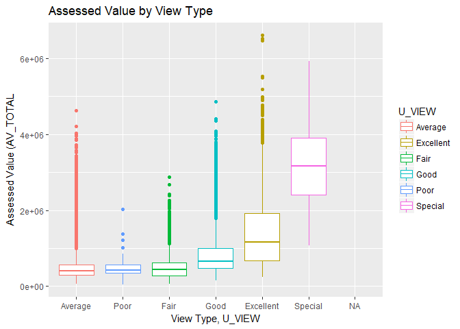

Data Exploration
================

We start with our raw, uncleaned data set of condominiums in the Boston area and their characteristics. We will do an examination of the basic structure of the data along with some of the variables to get a sense of the data.

This section will contain a snap shot of the data exploration. An indepth view of every variable will be provided in the appendices.

Data preprocessing will be handled in a seperate file.

The data set contains 61,223 observations with 76 variables.

This data set contains information about residential condonimium units. There are a series of categorical characteristics variables such as U\_KITCH\_STYLE which classifies the type of kitchen in the unit. There are numeric variables such as LIVING\_AREA which has the square footage of the living space in the unit. These variables will be used to predict our response variable, AV\_TOTAL, the assessed value of the unit.

The columns that begin with R\_ and S\_ are property characteristic values, but not for condonimiums. All of their values are missing and will be removed in the data preprocessing. There are also several columns that provide identification data about the cononimium such as owner, mailing address, and owner mailing address. These columns are not useful for our predictive model and will also be removed in the data preprocessing step.

``` r
glimpse(boston)
```

    ## Observations: 61,223
    ## Variables: 76
    ## $ PID             <chr> "0401750010_", "0401750012_", "0401750014_", "...
    ## $ Ward            <int> 4, 4, 4, 4, 4, 4, 4, 4, 4, 4, 4, 4, 4, 4, 4, 4...
    ## $ CM_ID           <chr> "0401750000_", "0401750000_", "0401750000_", "...
    ## $ GIS_ID          <chr> "0401750000_", "0401750000_", "0401750000_", "...
    ## $ ST_NUM          <chr> "210", "210", "210", "210", "210", "39", "39",...
    ## $ ST_NAME         <chr> "HEMENWAY", "HEMENWAY", "HEMENWAY", "HEMENWAY"...
    ## $ ST_NAME_SUF     <chr> "ST", "ST", "ST", "ST", "ST", "ST", "ST", "ST"...
    ## $ UNIT_NUM        <chr> "2-B", "2-C", "3-A", "3-B", "3-C", "1", "2", "...
    ## $ ZIPCODE         <chr> "02115_", "02115_", "02115_", "02115_", "02115...
    ## $ PTYPE           <int> 102, 102, 102, 102, 102, 102, 102, 102, 102, 1...
    ## $ LU              <chr> "CD", "CD", "CD", "CD", "CD", "CD", "CD", "CD"...
    ## $ OWN_OCC         <chr> "N", "N", "N", "N", "N", "N", "N", "N", "N", "...
    ## $ OWNER           <chr> "CREMIN NOREEN MARGARET TS", "DOLABANY RICHARD...
    ## $ MAIL_ADDRESSEE  <chr> "C/O JOSEPH FRANCIS TRUST", "C/O RICHARD DOLAB...
    ## $ MAIL_ADDRESS    <chr> "17 WALDEN DRIVE  APT #7", "80 PEARTREE DR", "...
    ## $ `MAIL CS`       <chr> "NATICK MA", "WESTWOOD MA", "SUN CITY CTR FL",...
    ## $ MAIL_ZIPCODE    <chr> "01760_", "02090_", "33573_", "02090_", "02115...
    ## $ AV_LAND         <int> 0, 0, 0, 0, 0, 0, 0, 0, 0, 0, 0, 0, 0, 0, 0, 0...
    ## $ AV_BLDG         <int> 331300, 294200, 304600, 331300, 284900, 762900...
    ## $ AV_TOTAL        <int> 331300, 294200, 304600, 331300, 284900, 762900...
    ## $ GROSS_TAX       <int> 350847, 311558, 322571, 350847, 301709, 807911...
    ## $ LAND_SF         <int> 529, 402, 366, 529, 420, 1493, 490, 260, 500, ...
    ## $ YR_BUILT        <int> 1890, 1890, 1890, 1890, 1890, 1920, 1920, 1920...
    ## $ YR_REMOD        <int> 1984, 1984, 1984, 1984, 1984, 1985, 1985, 1985...
    ## $ GROSS_AREA      <int> 529, 402, 388, 529, 420, 1493, 490, 260, 500, ...
    ## $ LIVING_AREA     <int> 529, 402, 388, 529, 420, 1493, 490, 260, 500, ...
    ## $ NUM_FLOORS      <dbl> 1, 1, 1, 1, 1, 2, 1, 1, 1, 1, 1, 1, 1, 1, 1, 1...
    ## $ STRUCTURE_CLASS <chr> NA, NA, NA, NA, NA, NA, NA, NA, NA, NA, NA, NA...
    ## $ R_BLDG_STYL     <chr> NA, NA, NA, NA, NA, NA, NA, NA, NA, NA, NA, NA...
    ## $ R_ROOF_TYP      <chr> NA, NA, NA, NA, NA, NA, NA, NA, NA, NA, NA, NA...
    ## $ R_EXT_FIN       <chr> NA, NA, NA, NA, NA, NA, NA, NA, NA, NA, NA, NA...
    ## $ R_TOTAL_RMS     <chr> NA, NA, NA, NA, NA, NA, NA, NA, NA, NA, NA, NA...
    ## $ R_BDRMS         <chr> NA, NA, NA, NA, NA, NA, NA, NA, NA, NA, NA, NA...
    ## $ R_FULL_BTH      <chr> NA, NA, NA, NA, NA, NA, NA, NA, NA, NA, NA, NA...
    ## $ R_HALF_BTH      <chr> NA, NA, NA, NA, NA, NA, NA, NA, NA, NA, NA, NA...
    ## $ R_BTH_STYLE     <chr> NA, NA, NA, NA, NA, NA, NA, NA, NA, NA, NA, NA...
    ## $ R_BTH_STYLE2    <chr> NA, NA, NA, NA, NA, NA, NA, NA, NA, NA, NA, NA...
    ## $ R_BTH_STYLE3    <chr> NA, NA, NA, NA, NA, NA, NA, NA, NA, NA, NA, NA...
    ## $ R_KITCH         <chr> NA, NA, NA, NA, NA, NA, NA, NA, NA, NA, NA, NA...
    ## $ R_KITCH_STYLE   <chr> NA, NA, NA, NA, NA, NA, NA, NA, NA, NA, NA, NA...
    ## $ R_KITCH_STYLE2  <chr> NA, NA, NA, NA, NA, NA, NA, NA, NA, NA, NA, NA...
    ## $ R_KITCH_STYLE3  <chr> NA, NA, NA, NA, NA, NA, NA, NA, NA, NA, NA, NA...
    ## $ R_HEAT_TYP      <chr> NA, NA, NA, NA, NA, NA, NA, NA, NA, NA, NA, NA...
    ## $ R_AC            <chr> NA, NA, NA, NA, NA, NA, NA, NA, NA, NA, NA, NA...
    ## $ R_FPLACE        <chr> NA, NA, NA, NA, NA, NA, NA, NA, NA, NA, NA, NA...
    ## $ R_EXT_CND       <chr> NA, NA, NA, NA, NA, NA, NA, NA, NA, NA, NA, NA...
    ## $ R_OVRALL_CND    <chr> NA, NA, NA, NA, NA, NA, NA, NA, NA, NA, NA, NA...
    ## $ R_INT_CND       <chr> NA, NA, NA, NA, NA, NA, NA, NA, NA, NA, NA, NA...
    ## $ R_INT_FIN       <chr> NA, NA, NA, NA, NA, NA, NA, NA, NA, NA, NA, NA...
    ## $ R_VIEW          <chr> NA, NA, NA, NA, NA, NA, NA, NA, NA, NA, NA, NA...
    ## $ S_NUM_BLDG      <chr> NA, NA, NA, NA, NA, NA, NA, NA, NA, NA, NA, NA...
    ## $ S_BLDG_STYL     <chr> NA, NA, NA, NA, NA, NA, NA, NA, NA, NA, NA, NA...
    ## $ S_UNIT_RES      <chr> NA, NA, NA, NA, NA, NA, NA, NA, NA, NA, NA, NA...
    ## $ S_UNIT_COM      <chr> NA, NA, NA, NA, NA, NA, NA, NA, NA, NA, NA, NA...
    ## $ S_UNIT_RC       <chr> NA, NA, NA, NA, NA, NA, NA, NA, NA, NA, NA, NA...
    ## $ S_EXT_FIN       <chr> NA, NA, NA, NA, NA, NA, NA, NA, NA, NA, NA, NA...
    ## $ S_EXT_CND       <chr> NA, NA, NA, NA, NA, NA, NA, NA, NA, NA, NA, NA...
    ## $ U_BASE_FLOOR    <int> 2, 2, 3, 3, 3, 0, 1, 1, 1, 1, 2, 2, 2, 2, 2, 2...
    ## $ U_NUM_PARK      <int> 0, 0, 0, 0, 0, 0, 0, 0, 0, 0, 0, 0, 0, 0, 0, 0...
    ## $ U_CORNER        <chr> "N", "N", "N", "N", "N", "N", "N", "N", "N", "...
    ## $ U_ORIENT        <chr> "A", "F", "F", "A", "T", "T", "T", "T", "T", "...
    ## $ U_TOT_RMS       <int> 3, 2, 2, 3, 2, 6, 3, 2, 3, 5, 2, 3, 3, 2, 3, 2...
    ## $ U_BDRMS         <int> 1, 1, 1, 1, 0, 2, 1, 1, 1, 2, 1, 1, 1, 0, 1, 1...
    ## $ U_FULL_BTH      <int> 1, 1, 1, 1, 1, 1, 1, 1, 1, 1, 1, 1, 1, 1, 1, 1...
    ## $ U_HALF_BTH      <int> 0, 0, 0, 0, 0, 0, 0, 0, 0, 0, 0, 0, 0, 0, 0, 0...
    ## $ U_BTH_STYLE     <chr> "S", "N", "S", "S", "N", "S", "S", "S", "S", "...
    ## $ U_BTH_STYLE2    <chr> NA, NA, NA, NA, NA, NA, NA, NA, NA, NA, NA, NA...
    ## $ U_BTH_STYLE3    <chr> NA, NA, NA, NA, NA, NA, NA, NA, NA, NA, NA, NA...
    ## $ U_KITCH_TYPE    <chr> "P", "O", "F", "P", "O", "F", "O", "P", "F", "...
    ## $ U_KITCH_STYLE   <chr> "S", "N", "S", "S", "N", "S", "S", "S", "S", "...
    ## $ U_HEAT_TYP      <chr> "W", "W", "W", "W", "W", "W", "W", "W", "W", "...
    ## $ U_AC            <chr> "N", "N", "N", "N", "N", "N", "N", "N", "N", "...
    ## $ U_FPLACE        <int> 0, 0, 0, 0, 0, 0, 0, 0, 0, 0, 0, 0, 0, 0, 0, 0...
    ## $ U_INT_FIN       <chr> "N", "N", "N", "N", "N", "N", "N", "N", "N", "...
    ## $ U_INT_CND       <chr> "A", "A", "A", "A", "A", "A", "A", "A", "A", "...
    ## $ U_VIEW          <chr> "A", "A", "A", "A", "A", "A", "A", "A", "A", "...

We start by examining the variable GROSS\_AREA. The summary statistics of GROSS\_AREA have the minimum value is zero and the maximum value is 13,943. A value of zero for the gross floor area does not make sense and a value of 13,943 would constitue a mansion. Neither of these values seem like a reasonable number for the amount of floor area, so we want to subset the data based on these values. A range of 500 to 3000 square feet was selected for the data.

``` r
boston %>% select(GROSS_AREA) %>% summary()
```

    ##    GROSS_AREA   
    ##  Min.   :    0  
    ##  1st Qu.:  690  
    ##  Median :  927  
    ##  Mean   : 1047  
    ##  3rd Qu.: 1250  
    ##  Max.   :13943  
    ##  NA's   :36

``` r
boston <- boston %>% .[.$GROSS_AREA >=500 & .$GROSS_AREA < 3000,]
```

The response variable is AV\_TOTAL which is the assessed value of the unit. First, we want to look at a summary of the variable. There appears to be a large spread in the data and from the plot below, the distribution is heavily right skewed.

``` r
boston %>% select(AV_TOTAL) %>% summary()
```

    ##     AV_TOTAL      
    ##  Min.   :  40500  
    ##  1st Qu.: 308900  
    ##  Median : 448338  
    ##  Mean   : 589238  
    ##  3rd Qu.: 661075  
    ##  Max.   :6614000  
    ##  NA's   :36

``` r
ggplot(boston) +
  geom_histogram(aes(x = AV_TOTAL), binwidth = 2000)
```

    ## Warning: Removed 36 rows containing non-finite values (stat_bin).


GROSS\_TAX and AV\_TOTAL are almost perfectly correlated.

``` r
ggplot(boston) +
  geom_point(aes(x=GROSS_TAX, y=AV_TOTAL))
```

    ## Warning: Removed 36 rows containing missing values (geom_point).


The assessed value is larger depending on the type of view the unit has. A view of "special" seems to be very important for the assessed value.

``` r
ggplot(boston) + 
  geom_boxplot(aes(x = reorder(U_VIEW, AV_TOTAL, FUN = median), 
                   y = AV_TOTAL))
```

    ## Warning: Removed 36 rows containing non-finite values (stat_boxplot).


