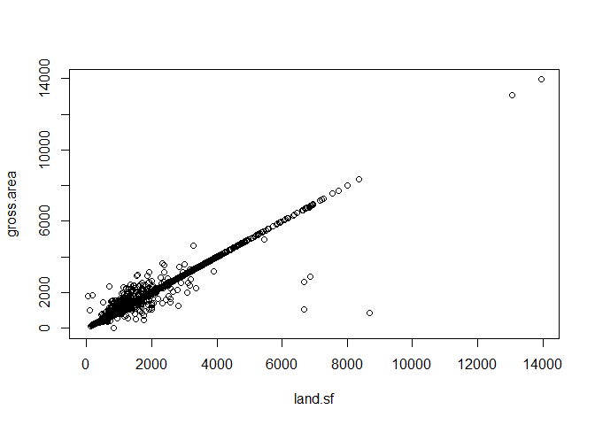
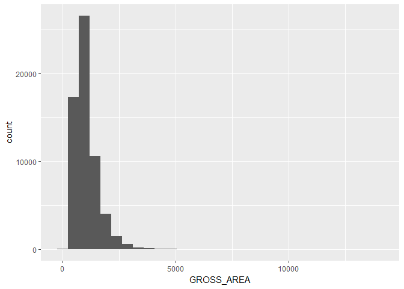

Data Wrangling
==============

This file will detail the data wrangling process for the raw data file for the boston condo assessment data.

Display the structure of each column in the Boston data to get a sense of the columns.

``` r
str(boston)
```

    ## 'data.frame':    61223 obs. of  76 variables:
    ##  $ PID            : Factor w/ 61223 levels "0100145002_",..: 16877 16878 16879 16880 16881 16882 16883 16884 16885 16886 ...
    ##  $ Ward           : int  4 4 4 4 4 4 4 4 4 4 ...
    ##  $ CM_ID          : Factor w/ 8740 levels "","0100145000_",..: 1870 1870 1870 1870 1870 1871 1871 1871 1871 1871 ...
    ##  $ GIS_ID         : Factor w/ 8752 levels "_","0100145000_",..: 1871 1871 1871 1871 1871 1872 1872 1872 1872 1872 ...
    ##  $ ST_NUM         : Factor w/ 2240 levels "","  18-20","  36A",..: 683 683 683 683 683 1187 1187 1187 1187 1187 ...
    ##  $ ST_NAME        : Factor w/ 1488 levels "A","ABBOT","ABBOTSFORD",..: 640 640 640 640 640 640 640 640 640 640 ...
    ##  $ ST_NAME_SUF    : Factor w/ 23 levels ""," ST","AV",..: 19 19 19 19 19 19 19 19 19 19 ...
    ##  $ UNIT_NUM       : Factor w/ 10390 levels ""," UNIT 23",..: 2773 2774 4317 4321 4322 31 2737 4284 5368 6052 ...
    ##  $ ZIPCODE        : Factor w/ 30 levels "02108_","02109_",..: 7 7 7 7 7 7 7 7 7 7 ...
    ##  $ PTYPE          : int  102 102 102 102 102 102 102 102 102 102 ...
    ##  $ LU             : Factor w/ 1 level "CD": 1 1 1 1 1 1 1 1 1 1 ...
    ##  $ OWN_OCC        : Factor w/ 2 levels "N","Y": 1 1 1 1 1 1 1 1 1 1 ...
    ##  $ OWNER          : Factor w/ 54788 levels "  HUANG  STEVEN  CHENG-FAN",..: 10587 13052 46313 13052 16118 10040 48852 6028 35760 54743 ...
    ##  $ MAIL_ADDRESSEE : Factor w/ 39026 levels ""," 25 CHESTER STREET UNIT 1 LL",..: 20946 31508 1 31508 1 8493 35921 8484 1 36517 ...
    ##  $ MAIL_ADDRESS   : Factor w/ 55674 levels " 10 PARKER RD",..: 13601 50472 12477 50472 19143 23519 32429 3580 32430 26578 ...
    ##  $ MAIL.CS        : Factor w/ 3054 levels " BOSTON         MA",..: 1721 2944 2591 2944 272 1867 272 508 272 272 ...
    ##  $ MAIL_ZIPCODE   : Factor w/ 2156 levels "00000_","00124_",..: 122 224 1466 224 235 30 235 363 235 302 ...
    ##  $ AV_LAND        : int  0 0 0 0 0 0 0 0 0 0 ...
    ##  $ AV_BLDG        : int  331300 294200 304600 331300 284900 762900 335000 243900 349400 496500 ...
    ##  $ AV_TOTAL       : int  331300 294200 304600 331300 284900 762900 335000 243900 349400 496500 ...
    ##  $ GROSS_TAX      : int  350847 311558 322571 350847 301709 807911 354765 258290 370015 525794 ...
    ##  $ LAND_SF        : int  529 402 366 529 420 1493 490 260 500 768 ...
    ##  $ YR_BUILT       : int  1890 1890 1890 1890 1890 1920 1920 1920 1920 1920 ...
    ##  $ YR_REMOD       : int  1984 1984 1984 1984 1984 1985 1985 1985 1985 2003 ...
    ##  $ GROSS_AREA     : int  529 402 388 529 420 1493 490 260 500 768 ...
    ##  $ LIVING_AREA    : int  529 402 388 529 420 1493 490 260 500 768 ...
    ##  $ NUM_FLOORS     : num  1 1 1 1 1 2 1 1 1 1 ...
    ##  $ STRUCTURE_CLASS: Factor w/ 6 levels "","A","B","C",..: 1 1 1 1 1 1 1 1 1 1 ...
    ##  $ R_BLDG_STYL    : logi  NA NA NA NA NA NA ...
    ##  $ R_ROOF_TYP     : logi  NA NA NA NA NA NA ...
    ##  $ R_EXT_FIN      : logi  NA NA NA NA NA NA ...
    ##  $ R_TOTAL_RMS    : logi  NA NA NA NA NA NA ...
    ##  $ R_BDRMS        : logi  NA NA NA NA NA NA ...
    ##  $ R_FULL_BTH     : logi  NA NA NA NA NA NA ...
    ##  $ R_HALF_BTH     : logi  NA NA NA NA NA NA ...
    ##  $ R_BTH_STYLE    : logi  NA NA NA NA NA NA ...
    ##  $ R_BTH_STYLE2   : logi  NA NA NA NA NA NA ...
    ##  $ R_BTH_STYLE3   : logi  NA NA NA NA NA NA ...
    ##  $ R_KITCH        : logi  NA NA NA NA NA NA ...
    ##  $ R_KITCH_STYLE  : logi  NA NA NA NA NA NA ...
    ##  $ R_KITCH_STYLE2 : logi  NA NA NA NA NA NA ...
    ##  $ R_KITCH_STYLE3 : logi  NA NA NA NA NA NA ...
    ##  $ R_HEAT_TYP     : logi  NA NA NA NA NA NA ...
    ##  $ R_AC           : logi  NA NA NA NA NA NA ...
    ##  $ R_FPLACE       : logi  NA NA NA NA NA NA ...
    ##  $ R_EXT_CND      : logi  NA NA NA NA NA NA ...
    ##  $ R_OVRALL_CND   : logi  NA NA NA NA NA NA ...
    ##  $ R_INT_CND      : logi  NA NA NA NA NA NA ...
    ##  $ R_INT_FIN      : logi  NA NA NA NA NA NA ...
    ##  $ R_VIEW         : logi  NA NA NA NA NA NA ...
    ##  $ S_NUM_BLDG     : logi  NA NA NA NA NA NA ...
    ##  $ S_BLDG_STYL    : logi  NA NA NA NA NA NA ...
    ##  $ S_UNIT_RES     : logi  NA NA NA NA NA NA ...
    ##  $ S_UNIT_COM     : logi  NA NA NA NA NA NA ...
    ##  $ S_UNIT_RC      : logi  NA NA NA NA NA NA ...
    ##  $ S_EXT_FIN      : logi  NA NA NA NA NA NA ...
    ##  $ S_EXT_CND      : logi  NA NA NA NA NA NA ...
    ##  $ U_BASE_FLOOR   : int  2 2 3 3 3 0 1 1 1 1 ...
    ##  $ U_NUM_PARK     : int  0 0 0 0 0 0 0 0 0 0 ...
    ##  $ U_CORNER       : Factor w/ 3 levels "","N","Y": 2 2 2 2 2 2 2 2 2 2 ...
    ##  $ U_ORIENT       : Factor w/ 18 levels "","a","A","B",..: 3 8 8 3 17 17 17 17 17 17 ...
    ##  $ U_TOT_RMS      : int  3 2 2 3 2 6 3 2 3 5 ...
    ##  $ U_BDRMS        : int  1 1 1 1 0 2 1 1 1 2 ...
    ##  $ U_FULL_BTH     : int  1 1 1 1 1 1 1 1 1 1 ...
    ##  $ U_HALF_BTH     : int  0 0 0 0 0 0 0 0 0 0 ...
    ##  $ U_BTH_STYLE    : Factor w/ 5 levels "","L","M","N",..: 5 4 5 5 4 5 5 5 5 5 ...
    ##  $ U_BTH_STYLE2   : Factor w/ 5 levels "","L","M","N",..: 1 1 1 1 1 1 1 1 1 1 ...
    ##  $ U_BTH_STYLE3   : Factor w/ 5 levels "","L","M","N",..: 1 1 1 1 1 1 1 1 1 1 ...
    ##  $ U_KITCH_TYPE   : Factor w/ 5 levels "","F","N","O",..: 5 4 2 5 4 2 4 5 2 4 ...
    ##  $ U_KITCH_STYLE  : Factor w/ 5 levels "","L","M","N",..: 5 4 5 5 4 5 5 5 5 3 ...
    ##  $ U_HEAT_TYP     : Factor w/ 14 levels "","C","D","E",..: 13 13 13 13 13 13 13 13 13 13 ...
    ##  $ U_AC           : Factor w/ 4 levels "","C","D","N": 4 4 4 4 4 4 4 4 4 4 ...
    ##  $ U_FPLACE       : int  0 0 0 0 0 0 0 0 0 0 ...
    ##  $ U_INT_FIN      : Factor w/ 10 levels "","A","C","E",..: 8 8 8 8 8 8 8 8 8 8 ...
    ##  $ U_INT_CND      : Factor w/ 6 levels "","A","E","F",..: 2 2 2 2 2 2 2 2 2 5 ...
    ##  $ U_VIEW         : Factor w/ 7 levels "","A","E","F",..: 2 2 2 2 2 2 2 2 2 2 ...

### Missing Values

An overview of the missing values in the raw, uncleaned data file.

``` r
# Look at the number of missing values in each column
print(colSums(is.na(boston)))
```

    ##             PID            Ward           CM_ID          GIS_ID 
    ##               0               0               0               0 
    ##          ST_NUM         ST_NAME     ST_NAME_SUF        UNIT_NUM 
    ##               0               0               0               0 
    ##         ZIPCODE           PTYPE              LU         OWN_OCC 
    ##               0               0               0               0 
    ##           OWNER  MAIL_ADDRESSEE    MAIL_ADDRESS         MAIL.CS 
    ##               0               0               0               0 
    ##    MAIL_ZIPCODE         AV_LAND         AV_BLDG        AV_TOTAL 
    ##               0               0               0               0 
    ##       GROSS_TAX         LAND_SF        YR_BUILT        YR_REMOD 
    ##               0               6              36            8918 
    ##      GROSS_AREA     LIVING_AREA      NUM_FLOORS STRUCTURE_CLASS 
    ##              36              36              50               0 
    ##     R_BLDG_STYL      R_ROOF_TYP       R_EXT_FIN     R_TOTAL_RMS 
    ##           61223           61223           61223           61223 
    ##         R_BDRMS      R_FULL_BTH      R_HALF_BTH     R_BTH_STYLE 
    ##           61223           61223           61223           61223 
    ##    R_BTH_STYLE2    R_BTH_STYLE3         R_KITCH   R_KITCH_STYLE 
    ##           61223           61223           61223           61223 
    ##  R_KITCH_STYLE2  R_KITCH_STYLE3      R_HEAT_TYP            R_AC 
    ##           61223           61223           61223           61223 
    ##        R_FPLACE       R_EXT_CND    R_OVRALL_CND       R_INT_CND 
    ##           61223           61223           61223           61223 
    ##       R_INT_FIN          R_VIEW      S_NUM_BLDG     S_BLDG_STYL 
    ##           61223           61223           61223           61223 
    ##      S_UNIT_RES      S_UNIT_COM       S_UNIT_RC       S_EXT_FIN 
    ##           61223           61223           61223           61223 
    ##       S_EXT_CND    U_BASE_FLOOR      U_NUM_PARK        U_CORNER 
    ##           61223              51              51               0 
    ##        U_ORIENT       U_TOT_RMS         U_BDRMS      U_FULL_BTH 
    ##               0              53              51              51 
    ##      U_HALF_BTH     U_BTH_STYLE    U_BTH_STYLE2    U_BTH_STYLE3 
    ##              53               0               0               0 
    ##    U_KITCH_TYPE   U_KITCH_STYLE      U_HEAT_TYP            U_AC 
    ##               0               0               0               0 
    ##        U_FPLACE       U_INT_FIN       U_INT_CND          U_VIEW 
    ##              51               0               0               0

The columns that begin with R\_ and S\_ are not relevant to condonimiums, so all their data is missing. These columns are completely removed along with non-informative columns such as owner's mailing address, etc.

``` r
# Create a list of columns to keep based on missing values and usefulness
keep <- c("PID","Ward","ZIPCODE",'PTYPE','AV_LAND','AV_BLDG','AV_TOTAL','GROSS_TAX',
          'LAND_SF','YR_BUILT','YR_REMOD','GROSS_AREA','LIVING_AREA','NUM_FLOORS',
          'STRUCTURE_CLASS','U_BASE_FLOOR','U_NUM_PARK','U_CORNER','U_ORIENT',
          'U_TOT_RMS','U_BDRMS','U_FULL_BTH','U_HALF_BTH','U_BTH_STYLE','U_KITCH_TYPE',
          'U_KITCH_STYLE','U_HEAT_TYP','U_AC','U_FPLACE','U_INT_FIN','U_INT_CND','U_VIEW')

# remove unwanted columns
boston <- boston[, keep]
# Display the number of missing values in each column 
print(colSums(is.na(boston)))
```

    ##             PID            Ward         ZIPCODE           PTYPE 
    ##               0               0               0               0 
    ##         AV_LAND         AV_BLDG        AV_TOTAL       GROSS_TAX 
    ##               0               0               0               0 
    ##         LAND_SF        YR_BUILT        YR_REMOD      GROSS_AREA 
    ##               6              36            8918              36 
    ##     LIVING_AREA      NUM_FLOORS STRUCTURE_CLASS    U_BASE_FLOOR 
    ##              36              50               0              51 
    ##      U_NUM_PARK        U_CORNER        U_ORIENT       U_TOT_RMS 
    ##              51               0               0              53 
    ##         U_BDRMS      U_FULL_BTH      U_HALF_BTH     U_BTH_STYLE 
    ##              51              51              53               0 
    ##    U_KITCH_TYPE   U_KITCH_STYLE      U_HEAT_TYP            U_AC 
    ##               0               0               0               0 
    ##        U_FPLACE       U_INT_FIN       U_INT_CND          U_VIEW 
    ##              51               0               0               0

Year Remodeled: YR\_REMOD
-------------------------

The column for the year the condo was remodeled has the largest number of missing values. The missing values for YR\_REMOD will be replaced with YR\_BUILT. After doing this, there were several rows that still had missing values for YR\_REMOD. These columns were examined closely and they were missing values in the majority of columns, so they were removed from the data set.

``` r
# Replace missing values with YR_BUILT value
boston$YR_REMOD[is.na(boston$YR_REMOD)] <- boston$YR_BUILT[is.na(boston$YR_REMOD)] 

# There are 36 rows that still have NA for YR_REMOD
# a quick look into those rows, reveals there is minimal data in those rows
# they will be omitted for now
boston <- boston[!is.na(boston$YR_REMOD),]

# Found a number of rows where YR_REMOD is less than YR_BUILT
# Replace zero value with YR_BUILT
boston$YR_REMOD[boston$YR_BUILT > boston$YR_REMOD] <- boston$YR_BUILT[boston$YR_BUILT > boston$YR_REMOD] 

# Look at the number of missing values in each column
print(colSums(is.na(boston)))
```

    ##             PID            Ward         ZIPCODE           PTYPE 
    ##               0               0               0               0 
    ##         AV_LAND         AV_BLDG        AV_TOTAL       GROSS_TAX 
    ##               0               0               0               0 
    ##         LAND_SF        YR_BUILT        YR_REMOD      GROSS_AREA 
    ##               6               0               0               0 
    ##     LIVING_AREA      NUM_FLOORS STRUCTURE_CLASS    U_BASE_FLOOR 
    ##               0              14               0              15 
    ##      U_NUM_PARK        U_CORNER        U_ORIENT       U_TOT_RMS 
    ##              15               0               0              17 
    ##         U_BDRMS      U_FULL_BTH      U_HALF_BTH     U_BTH_STYLE 
    ##              15              15              17               0 
    ##    U_KITCH_TYPE   U_KITCH_STYLE      U_HEAT_TYP            U_AC 
    ##               0               0               0               0 
    ##        U_FPLACE       U_INT_FIN       U_INT_CND          U_VIEW 
    ##              15               0               0               0

Number of Fireplaces: U\_FPLACE
-------------------------------

An examination of rows were U\_FPLACE is missing shows another set of columns where the majority of the data is missing. These rows were removed from the data set

``` r
# remove rows were U_FPLACE is missing
boston <- boston[!is.na(boston$U_FPLACE),]
```

Number of Total Rooms: U\_TOT\_RMS
----------------------------------

There were two columns that had missing values for U\_TOT\_RMS. Each column had one half bath and one full bathroom. Based on the amount of living area, I found the average number of total rooms for similar condos in the data. Each missing value was replaced with the rounded average of the total number of rooms for condos with a similar amount of living area.

``` r
# They have 1/1 bathrooms, LIVING_AREA=658&845
boston[is.na(boston$U_TOT_RMS),c("U_TOT_RMS","LIVING_AREA","U_FULL_BTH","U_HALF_BTH")]
```

    ##       U_TOT_RMS LIVING_AREA U_FULL_BTH U_HALF_BTH
    ## 16325        NA         845          1          0
    ## 58522        NA         658          1          0

``` r
# Find the mean of U_TOT_RMS for condos that have Living Area between 650 and 660 with 1/1 baths
x <- mean(boston$U_TOT_RMS[boston$LIVING_AREA < 660  & boston$LIVING_AREA >= 650 & boston$U_FULL_BTH == 1 & boston$U_BDRMS == 1], na.rm=TRUE)
# Mean equals 3.1, so replace U_TOT_RMS with 3
boston$U_TOT_RMS[boston$PID == "2102476062_"] <- 3

## replace value for PID = 0401461022_
# Find the mean of U_TOT_RMS for condos that have Living Area between 650 and 660 with 1/1 baths
x <- mean(boston$U_TOT_RMS[boston$LIVING_AREA < 850  & boston$LIVING_AREA >= 840 & boston$U_FULL_BTH == 1 & boston$U_BDRMS == 1], na.rm=TRUE)
# Mean equals 3.2, so replace U_TOT_RMS with 3
boston$U_TOT_RMS[boston$PID == "0401461022_"] <- 3
```

Number of Half Baths: U\_HALF\_BTH
----------------------------------

There were two rows that had missing values for U\_HALF\_BTH. Both rows had three bedrooms and one full bath. I imputed these missing values with the average number of half baths from condos with three bedrooms and one full bath.

``` r
# There are two rows with U_HALF_BTH missing, replace NA with 0
boston[is.na(boston$U_HALF_BTH),c("U_HALF_BTH","U_FULL_BTH","U_BDRMS")]
```

    ##       U_HALF_BTH U_FULL_BTH U_BDRMS
    ## 40793         NA          1       3
    ## 44841         NA          1       3

``` r
x <- mean(boston[boston$U_FULL_BTH == 1 & boston$U_BDRMS == 3,"U_HALF_BTH"], na.rm=TRUE)
boston$U_HALF_BTH[is.na(boston$U_HALF_BTH)] <- 0
```

Land Area in square feet: LAND\_SF
----------------------------------

There were six rows with missing values for LAND\_SF. The correlation between LAND\_SF and GROSS\_AREA was .99, so the missing values for LAND\_SF were replaced with GROSS\_AREA.

``` r
# There are six missing rows for LAND_SF
boston[is.na(boston$LAND_SF),c("PID","LAND_SF","GROSS_AREA")]
```

    ##               PID LAND_SF GROSS_AREA
    ## 17907 0402709002_      NA       2460
    ## 17908 0402709004_      NA       3563
    ## 23712 0502901004_      NA       3548
    ## 31467 0603381002_      NA       2041
    ## 31657 0603615088_      NA       1126
    ## 47615 1900572002_      NA       1866

``` r
# find correlation between LAND_SF and GROSS_AREA
land.sf <- boston$LAND_SF[!is.na(boston$LAND_SF)]
gross.area <- boston$GROSS_AREA[!is.na(boston$LAND_SF)]
print(cor(land.sf,gross.area))
```

    ## [1] 0.9938449

``` r
plot(land.sf,gross.area)
```



``` r
# correlation = .99, replace NA in LAND_SF with GROSS_AREA
boston$LAND_SF[is.na(boston$LAND_SF)] <- boston$GROSS_AREA[is.na(boston$LAND_SF)]
```

All missing values in the data have been dealt with.

``` r
## Display the number of missing values in each column
print(colSums(is.na(boston)))
```

    ##             PID            Ward         ZIPCODE           PTYPE 
    ##               0               0               0               0 
    ##         AV_LAND         AV_BLDG        AV_TOTAL       GROSS_TAX 
    ##               0               0               0               0 
    ##         LAND_SF        YR_BUILT        YR_REMOD      GROSS_AREA 
    ##               0               0               0               0 
    ##     LIVING_AREA      NUM_FLOORS STRUCTURE_CLASS    U_BASE_FLOOR 
    ##               0               0               0               0 
    ##      U_NUM_PARK        U_CORNER        U_ORIENT       U_TOT_RMS 
    ##               0               0               0               0 
    ##         U_BDRMS      U_FULL_BTH      U_HALF_BTH     U_BTH_STYLE 
    ##               0               0               0               0 
    ##    U_KITCH_TYPE   U_KITCH_STYLE      U_HEAT_TYP            U_AC 
    ##               0               0               0               0 
    ##        U_FPLACE       U_INT_FIN       U_INT_CND          U_VIEW 
    ##               0               0               0               0

Examination of Columns
======================

#### Gross Floor Area: GROSS\_AREA

An examination of gross floor area reveals that the minimum value is zero. This does not seem like a reasonable number for the amount of floor area. A range of 500 to 3000 square feet was selected for the data.

``` r
# The miniumum value for GROSS_AREA is 0 and the max is 13,943
summary(boston$GROSS_AREA)
```

    ##    Min. 1st Qu.  Median    Mean 3rd Qu.    Max. 
    ##       0     690     927    1048    1250   13943

``` r
ggplot(data=boston, aes(x=GROSS_AREA)) +
  geom_histogram()
```

    ## `stat_bin()` using `bins = 30`. Pick better value with `binwidth`.



``` r
# We will make our range 500 - 3000 sq feet 
boston <- boston[boston$GROSS_AREA >= 500 & boston$GROSS_AREA < 3000,]
```

#### Year Built: YR\_BUILT

A number of values were found where the year built was zero. These values were imputed with the median value of the column. This caused a number of YR\_REMOD values to also not be correct, so these were adjusted as well.

``` r
# A few rows have YR_BUILT = 0, impute with median value
boston$YR_BUILT[boston$YR_BUILT == 0] <- median(boston$YR_BUILT)
# Impute YR_REMOD values that equal 0 with YR_BUILT values
boston$YR_REMOD[boston$YR_REMOD == 0] <- boston$YR_BUILT[boston$YR_REMOD == 0]
```

#### Gross Tax: GROSS\_TAX

The gross tax for a condominium is supposed to be 10.59% of the accessed value of the condominium. A summary of the two columns has the mean values very close. It appears that GROSS\_TAX is missing a decimal point.

``` r
# look at response variable, AV_TOTAL
summary(boston$AV_TOTAL)
```

    ##    Min. 1st Qu.  Median    Mean 3rd Qu.    Max. 
    ##   40500  308900  448338  589238  661075 6614000

``` r
# look at GROSS_TAX
summary(boston$GROSS_TAX)
```

    ##    Min. 1st Qu.  Median    Mean 3rd Qu.    Max. 
    ##   42890  327125  474842  624009  700078 7004226

``` r
# The mean values of these two columns are very close and they should not be
# GROSS_TAX should be about 10.59% of AV_TOTAL
boston$GROSS_TAX <- boston$GROSS_TAX / 10
summary(boston$GROSS_TAX)
```

    ##    Min. 1st Qu.  Median    Mean 3rd Qu.    Max. 
    ##    4289   32713   47484   62401   70008  700423

A new column was created to check the relationship between GROSS\_TAX and AV\_TOTAL. The ratio between the two columns should be 10.59 which is the mean value of our new column, ratio.

``` r
# Create a new column to check that the ratio between AV_TOTAL and GROSS_TAX is correct
boston$ratio <- ( boston$GROSS_TAX / boston$AV_TOTAL) * 100
summary(boston$ratio)
```

    ##    Min. 1st Qu.  Median    Mean 3rd Qu.    Max. 
    ##   10.59   10.59   10.59   10.59   10.59   14.78

Categorical Columns
===================

The categorical columns are each examined and reduced to the smallest number of appropriate levels. Dummy variables were then created and added to the data frame.

#### U\_ORIENT

Describes the Orientation of condo unit within the building. There are several levels that are undefined by the data key, so these levels are integrated into one level.

``` r
# Display a frequency table of U_ORIENT
summary(boston$U_ORIENT)
```

    ##           a     A     B     C     E     f     F     G     m     M     N 
    ##     0     2  7480   862  1460   117     2 13122     4     1  1586     1 
    ##     Q     R     S     t     T     Y 
    ##     1     1     1     2 31455     1

``` r
# Replace them with uppercase values
boston$U_ORIENT[boston$U_ORIENT == 'a'] <- 'A'
boston$U_ORIENT[boston$U_ORIENT == 'f'] <- 'F'
boston$U_ORIENT[boston$U_ORIENT == 'm'] <- 'M'
boston$U_ORIENT[boston$U_ORIENT == 't'] <- 'T'

# Set all unknown values to Y
boston$U_ORIENT[boston$U_ORIENT == 'G'] <- 'Y'
boston$U_ORIENT[boston$U_ORIENT == 'N'] <- 'Y'
boston$U_ORIENT[boston$U_ORIENT == 'Q'] <- 'Y'
boston$U_ORIENT[boston$U_ORIENT == 'R'] <- 'Y'
boston$U_ORIENT[boston$U_ORIENT == 'S'] <- 'Y'

# drop unused levels
boston$U_ORIENT <- droplevels(boston$U_ORIENT)

# rename levels to more descriptive names
levels(boston$U_ORIENT) <- c("Rear_Above","Rear_Below","Face","End","Front","Middle","Through","Unknown")
summary(boston$U_ORIENT)
```

    ## Rear_Above Rear_Below       Face        End      Front     Middle 
    ##       7482        862       1460        117      13124       1587 
    ##    Through    Unknown 
    ##      31457          9

``` r
# create dummy variables for U_ORIENT
U_ORIENT_dummies = model.matrix(~U_ORIENT,boston)
# drop the intercept column created by model.matrix
U_ORIENT_dummies <- U_ORIENT_dummies[,2:8]

# combine boston with dummy matrix for U_ORIENT
boston <- cbind(boston, U_ORIENT_dummies)
```

#### U\_VIEW

Describes the type of view for the condo.

``` r
# Display a frequency table of U_VIEW
summary(boston$U_VIEW)
```

    ##           A     E     F     G     P     S 
    ##     0 43123  2916  2404  7406   140   109

``` r
# set values of poor to average
boston$U_VIEW[boston$U_VIEW == "P"] <- "A"

boston$U_VIEW <- droplevels(boston$U_VIEW)
# rename levels
levels(boston$U_VIEW) <- c("Average","Excellent","Fair","Good","Special")
summary(boston$U_VIEW)
```

    ##   Average Excellent      Fair      Good   Special 
    ##     43263      2916      2404      7406       109

``` r
# create dummy variables for U_VIEW
U_VIEW_dummies <- model.matrix(~U_VIEW,boston)

# combine boston with dummy matrix for U_ORIENT
boston <- cbind(boston, U_VIEW_dummies[,2:5])
```

#### Examine U\_INT\_CND

Describes the condo unit interior condition.

``` r
# Display a frequency table for U_INT_CND
summary(boston$U_INT_CND)
```

    ##           A     E     F     G     P 
    ##     0 22052  5650   189 28183    24

``` r
# set values of fair and poor to average
boston$U_INT_CND[boston$U_INT_CND == "P"] <- "A"
boston$U_INT_CND[boston$U_INT_CND == "F"] <- "A"

boston$U_INT_CND <- droplevels(boston$U_INT_CND)
# rename levels
levels(boston$U_INT_CND) <- c("Average","Excellent","Good")
summary(boston$U_INT_CND)
```

    ##   Average Excellent      Good 
    ##     22265      5650     28183

``` r
# create dummy variables for U_VIEW
U_INT_CND_dummies <- model.matrix(~U_INT_CND,boston)

# combine boston with dummy matrix for U_ORIENT
boston <- cbind(boston, U_INT_CND_dummies[,2:3])
# drop U_ORIENT column
boston <- subset(boston,select = -c(U_INT_CND))
```

#### Examine U\_KITCH\_STYLE

Describes the condo unit kitchen style.

``` r
# Display a frequency table of U_KITCH_STYLE
summary(boston$U_KITCH_STYLE)
```

    ##           L     M     N     S 
    ##     0  3095 28628  1273 23102

``` r
boston$U_KITCH_STYLE <- droplevels(boston$U_KITCH_STYLE)
# rename levels
levels(boston$U_KITCH_STYLE) <- c("Luxury","Modern","No_Remodeling","Semi_Modern")

# rearrange the levels of the factor
boston$U_KITCH_STYLE <- factor(boston$U_KITCH_STYLE, levels = c("Modern","Luxury","No_Remodeling","Semi_Modern"))
summary(boston$U_KITCH_STYLE)
```

    ##        Modern        Luxury No_Remodeling   Semi_Modern 
    ##         28628          3095          1273         23102

``` r
# create dummy variables for U_VIEW
U_dummies <- model.matrix(~U_KITCH_STYLE,boston)

# combine boston with dummy matrix for U_ORIENT
boston <- cbind(boston, U_dummies[,2:4])
```

#### Examine U\_KITCH\_TYPE

Describes the condo unit kitchen type.

``` r
# Display a frequency table of U_KITCH_STYLE
summary(boston$U_KITCH_TYPE)
```

    ##           F     N     O     P 
    ##     0 20378    93 34407  1220

``` r
# set values for one-person equal to pull/alcove
boston$U_KITCH_TYPE[boston$U_KITCH_TYPE == "P"] <- "O"

boston$U_KITCH_TYPE <- droplevels(boston$U_KITCH_TYPE)
# rename levels
levels(boston$U_KITCH_TYPE) <- c("Full","None","One_Person")

# rearrange the levels of the factor
boston$U_KITCH_TYPE <- factor(boston$U_KITCH_TYPE, levels = c("One_Person","Full","None"))
summary(boston$U_KITCH_TYPE)
```

    ## One_Person       Full       None 
    ##      35627      20378         93

``` r
# create dummy variables for U_VIEW
U_dummies <- model.matrix(~U_KITCH_TYPE,boston)

# combine boston with dummy matrix for U_ORIENT
boston <- cbind(boston, U_dummies[,2:3])
```

#### Examine U\_BTH\_STYLE

Describes the condo unit bathroom style.

``` r
# Display a frequency table of U_BTH_STYLE
summary(boston$U_BTH_STYLE)
```

    ##           L     M     N     S 
    ##     0  2955 27072  1293 24778

``` r
boston$U_BTH_STYLE <- droplevels(boston$U_BTH_STYLE)
# rename levels
levels(boston$U_BTH_STYLE) <- c("Luxury","Modern","No_Remodeling","Semi_Modern")

# rearrange the levels of the factor
boston$U_BTH_STYLE <- factor(boston$U_BTH_STYLE, levels = c("Modern","Luxury","No_Remodeling","Semi_Modern"))
summary(boston$U_BTH_STYLE)
```

    ##        Modern        Luxury No_Remodeling   Semi_Modern 
    ##         27072          2955          1293         24778

``` r
# create dummy variables for U_VIEW
U_dummies <- model.matrix(~U_BTH_STYLE,boston)

# combine boston with dummy matrix for U_ORIENT
boston <- cbind(boston, U_dummies[,2:4])
```

#### Examine U\_HEAT\_TYPE

Describes the condo unit heating type.

``` r
# Display a frequency table of U_HEAT_TYPE
summary(boston$U_HEAT_TYP)
```

    ##           C     D     E     f     F     G     I     N     O     P     S 
    ##     2    17     2  4240     1 22215     1     1     2    16  3925    69 
    ##     W     Y 
    ## 25573    34

``` r
boston$U_HEAT_TYP[boston$U_HEAT_TYP != "F" & boston$U_HEAT_TYP != "W" &  boston$U_HEAT_TYP != "P"] <- "E"

# drop unused levels
boston$U_HEAT_TYP <- droplevels(boston$U_HEAT_TYP)

# rename levels
levels(boston$U_HEAT_TYP) <- c("Electric","Forced Air","Heat Pump","Hot Water")
summary(boston$U_HEAT_TYP)
```

    ##   Electric Forced Air  Heat Pump  Hot Water 
    ##       4385      22215       3925      25573

``` r
# create dummy variables for U_VIEW
U_dummies <- model.matrix(~U_HEAT_TYP,boston)

# combine boston with dummy matrix for U_ORIENT
boston <- cbind(boston, U_dummies[,2:4])
```

#### Examine U\_INT\_FIN

Describes the condo unit interior finish.

``` r
# Display a frequency table of U_INT_FIN
summary(boston$U_INT_FIN)
```

    ##           A     C     E     F     G     n     N     S     T 
    ##     0    22     2  1990     1     7     1 54026    48     1

``` r
boston$U_INT_FIN[boston$U_INT_FIN != "E" & boston$U_INT_FIN != "S"] <- "N"

# drop unused levels
boston$U_INT_FIN <- droplevels(boston$U_INT_FIN)

# rename levels
levels(boston$U_INT_FIN) <- c("Elaborate","Normal","Substandard")
# rearrange the levels of the factor
boston$U_INT_FIN <- factor(boston$U_INT_FIN, levels = c("Normal","Elaborate","Substandard"))
summary(boston$U_INT_FIN)
```

    ##      Normal   Elaborate Substandard 
    ##       54060        1990          48

``` r
# create dummy variables for U_VIEW
U_dummies <- model.matrix(~boston$U_INT_FIN)

# combine boston with dummy matrix for U_ORIENT
boston <- cbind(boston, U_dummies[,2:3])
```
