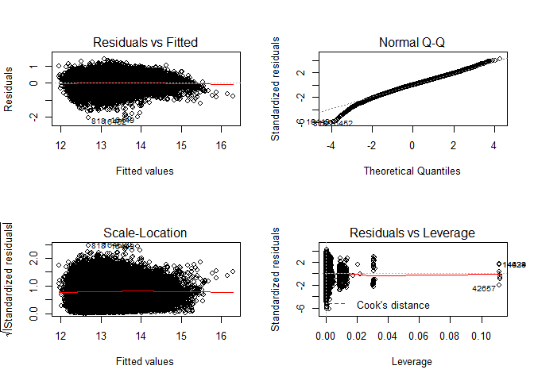
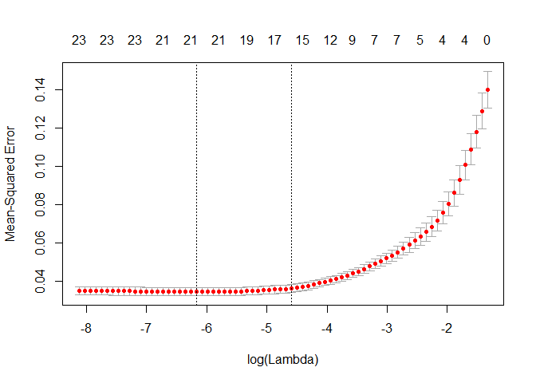

Linear Models
=============

Research Question: Determine if the predictors affect each ward differently.

We will examine this questions by building linear regression models and then lasso models. We are focused on prediction and accurately predicting our response, AV\_TOTAL, the assessed value of the condominium. For this section, we will be used a transformed version of the response, Log(AV\_TOTAL). The reason for this was to handle the issue of non-constant variance in the modeling.

    ## -- Attaching packages --------------------------------------------------------------------------------------------------------------- tidyverse 1.2.1 --

    ## v ggplot2 2.2.1     v purrr   0.2.4
    ## v tibble  1.4.2     v dplyr   0.7.4
    ## v tidyr   0.7.2     v stringr 1.2.0
    ## v readr   1.1.1     v forcats 0.2.0

    ## -- Conflicts ------------------------------------------------------------------------------------------------------------------ tidyverse_conflicts() --
    ## x dplyr::filter() masks stats::filter()
    ## x dplyr::lag()    masks stats::lag()

    ## Loading required package: Matrix

    ## 
    ## Attaching package: 'Matrix'

    ## The following object is masked from 'package:tidyr':
    ## 
    ##     expand

    ## Loading required package: foreach

    ## 
    ## Attaching package: 'foreach'

    ## The following objects are masked from 'package:purrr':
    ## 
    ##     accumulate, when

    ## Loaded glmnet 2.0-13

In our data, there are a few extraneous columns that we will not be using in this script. There is the raw response variable, AV\_TOTAL, and a scaled version of the response, av\_total\_scaled. There is also an unique identifier for each row, PID, which we will not need for the time being.

``` r
pred <- c("GROSS_AREA",                  "U_KITCH_STYLE_Luxury",        "U_INTERIOR_FINISH_fi",       
          "NUM_FLOORS",                  "U_FPLACE",                    "U_VIEW_Excellent",           
          "U_VIEW_Special",              "U_FULL_BTH",                  "YR_BUILT",                   
          "U_INT_CND_Excellent",         "U_BDRMS",                     "U_HALF_BTH",                 
          "U_ORIENT_fixed_Throu",        "U_NUM_PARK",                  "U_HEAT_TYPE_fixed_Fo",       
          "U_KITCH_TYPE_Full_ea",        "U_BTH_STYLE_Luxury",          "U_HEAT_TYPE_fixed_Ho",       
          "U_BASE_FLOOR",                "U_VIEW_Good",                 "U_CORNER_Yes",               
          "U_ORIENT_fixed_Face_",        "U_TOT_RMS",                   "U_ORIENT_fixed_Middl",       
          "U_INTERIOR_FINISH_fi2",       "U_ORIENT_fixed_Rear_",        "U_INT_CND_Good",             
          "U_VIEW_Fair",                 "U_KITCH_STYLE_No_remodeling", "U_KITCH_STYLE_Semi_modern",  
          "U_ORIENT_fixed_End",          "U_ORIENT_fixed_Rear_above",   "U_ORIENT_fixed_Unknown",     
          "U_HEAT_TYPE_fixed_Heat_Pump", "U_KITCH_TYPE_None",           "U_BTH_STYLE_No_remodeling",  
          "U_BTH_STYLE_Semi_modern",     "Log_LIVING_AREA_"         
)

boston_p <- select(boston, c("Log_AV_TOTAL_", pred))
```

Full Model
----------

We will start by building a model to predict Log\_AV\_TOTAL that ignores the ward of the condo. By fitting a linear regression model with all the predictors, this should give us a sense of what predictors are important. It also gives us an opportunity to look at the variance of the model to check for non-constant variance in the errors.

``` r
boston.lm <- lm(Log_AV_TOTAL_ ~ ., data = boston_p)
summary(boston.lm)
```

    ## 
    ## Call:
    ## lm(formula = Log_AV_TOTAL_ ~ ., data = boston_p)
    ## 
    ## Residuals:
    ##     Min      1Q  Median      3Q     Max 
    ## -2.0868 -0.2057  0.0105  0.2245  1.4224 
    ## 
    ## Coefficients:
    ##                               Estimate Std. Error t value
    ## (Intercept)                 14.0406391  0.1080600  129.93
    ## GROSS_AREA                   0.0001206  0.0000108   11.14
    ## U_KITCH_STYLE_Luxury         0.2199185  0.0123012   17.88
    ## U_INTERIOR_FINISH_fi         0.2205680  0.0088702   24.87
    ## NUM_FLOORS                  -0.0878855  0.0033061  -26.58
    ## U_FPLACE                     0.1464341  0.0028648   51.12
    ## U_VIEW_Excellent             0.2922063  0.0087238   33.50
    ## U_VIEW_Special               0.8175974  0.0334451   24.45
    ## U_FULL_BTH                   0.2043601  0.0040571   50.37
    ## YR_BUILT                    -0.0027983  0.0000381  -73.44
    ## U_INT_CND_Excellent          0.4093997  0.0074828   54.71
    ## U_BDRMS                     -0.0653062  0.0033137  -19.71
    ## U_HALF_BTH                   0.1171249  0.0046008   25.46
    ## U_ORIENT_fixed_Throu        -0.0991616  0.0041298  -24.01
    ## U_NUM_PARK                  -0.0716175  0.0024685  -29.01
    ## U_HEAT_TYPE_fixed_Fo        -0.0456617  0.0058657   -7.78
    ## U_KITCH_TYPE_Full_ea        -0.0920043  0.0033293  -27.63
    ## U_BTH_STYLE_Luxury           0.0807243  0.0126316    6.39
    ## U_HEAT_TYPE_fixed_Ho        -0.0024743  0.0056347   -0.44
    ## U_BASE_FLOOR                 0.0130487  0.0004924   26.50
    ## U_VIEW_Good                  0.1538639  0.0047889   32.13
    ## U_CORNER_Yes                -0.0131364  0.0039208   -3.35
    ## U_ORIENT_fixed_Face_        -0.0699871  0.0094601   -7.40
    ## U_TOT_RMS                   -0.0360588  0.0022474  -16.04
    ## U_ORIENT_fixed_Middl        -0.1220909  0.0091246  -13.38
    ## U_INTERIOR_FINISH_fi2       -0.5265798  0.0591686   -8.90
    ## U_ORIENT_fixed_Rear_        -0.1493242  0.0123945  -12.05
    ## U_INT_CND_Good               0.2254891  0.0041368   54.51
    ## U_VIEW_Fair                  0.0680618  0.0073996    9.20
    ## U_KITCH_STYLE_No_remodeling -0.1237595  0.0158305   -7.82
    ## U_KITCH_STYLE_Semi_modern   -0.0698596  0.0061031  -11.45
    ## U_ORIENT_fixed_End           0.0419098  0.0315480    1.33
    ## U_ORIENT_fixed_Rear_above   -0.0451485  0.0049535   -9.11
    ## U_ORIENT_fixed_Unknown      -0.1720884  0.1130799   -1.52
    ## U_HEAT_TYPE_fixed_Heat_Pump  0.0800469  0.0076748   10.43
    ## U_KITCH_TYPE_None            0.0349408  0.0386907    0.90
    ## U_BTH_STYLE_No_remodeling    0.0698596  0.0154062    4.53
    ## U_BTH_STYLE_Semi_modern      0.0129082  0.0060321    2.14
    ## Log_LIVING_AREA_             0.6200437  0.0133874   46.32
    ##                                         Pr(>|t|)    
    ## (Intercept)                 < 0.0000000000000002 ***
    ## GROSS_AREA                  < 0.0000000000000002 ***
    ## U_KITCH_STYLE_Luxury        < 0.0000000000000002 ***
    ## U_INTERIOR_FINISH_fi        < 0.0000000000000002 ***
    ## NUM_FLOORS                  < 0.0000000000000002 ***
    ## U_FPLACE                    < 0.0000000000000002 ***
    ## U_VIEW_Excellent            < 0.0000000000000002 ***
    ## U_VIEW_Special              < 0.0000000000000002 ***
    ## U_FULL_BTH                  < 0.0000000000000002 ***
    ## YR_BUILT                    < 0.0000000000000002 ***
    ## U_INT_CND_Excellent         < 0.0000000000000002 ***
    ## U_BDRMS                     < 0.0000000000000002 ***
    ## U_HALF_BTH                  < 0.0000000000000002 ***
    ## U_ORIENT_fixed_Throu        < 0.0000000000000002 ***
    ## U_NUM_PARK                  < 0.0000000000000002 ***
    ## U_HEAT_TYPE_fixed_Fo          0.0000000000000071 ***
    ## U_KITCH_TYPE_Full_ea        < 0.0000000000000002 ***
    ## U_BTH_STYLE_Luxury            0.0000000001664482 ***
    ## U_HEAT_TYPE_fixed_Ho                     0.66058    
    ## U_BASE_FLOOR                < 0.0000000000000002 ***
    ## U_VIEW_Good                 < 0.0000000000000002 ***
    ## U_CORNER_Yes                             0.00081 ***
    ## U_ORIENT_fixed_Face_          0.0000000000001400 ***
    ## U_TOT_RMS                   < 0.0000000000000002 ***
    ## U_ORIENT_fixed_Middl        < 0.0000000000000002 ***
    ## U_INTERIOR_FINISH_fi2       < 0.0000000000000002 ***
    ## U_ORIENT_fixed_Rear_        < 0.0000000000000002 ***
    ## U_INT_CND_Good              < 0.0000000000000002 ***
    ## U_VIEW_Fair                 < 0.0000000000000002 ***
    ## U_KITCH_STYLE_No_remodeling   0.0000000000000055 ***
    ## U_KITCH_STYLE_Semi_modern   < 0.0000000000000002 ***
    ## U_ORIENT_fixed_End                       0.18404    
    ## U_ORIENT_fixed_Rear_above   < 0.0000000000000002 ***
    ## U_ORIENT_fixed_Unknown                   0.12806    
    ## U_HEAT_TYPE_fixed_Heat_Pump < 0.0000000000000002 ***
    ## U_KITCH_TYPE_None                        0.36649    
    ## U_BTH_STYLE_No_remodeling     0.0000057852522724 ***
    ## U_BTH_STYLE_Semi_modern                  0.03236 *  
    ## Log_LIVING_AREA_            < 0.0000000000000002 ***
    ## ---
    ## Signif. codes:  0 '***' 0.001 '**' 0.01 '*' 0.05 '.' 0.1 ' ' 1
    ## 
    ## Residual standard error: 0.339 on 56049 degrees of freedom
    ## Multiple R-squared:  0.704,  Adjusted R-squared:  0.704 
    ## F-statistic: 3.52e+03 on 38 and 56049 DF,  p-value: <0.0000000000000002

Our diagnostic plots appear to be okay, but there are some problems. We see some deviation from normality in the residuals in the Q-Q plot. I think that deviation is probably acceptable. There does appear to be non-constant variance in the residuals in the Residuals vs Fitted plot.

``` r
par(mfrow=c(2,2))
plot(boston.lm)
```



The overall mean squared error of the model is 0.1149.

``` r
mean((predict(boston.lm) - boston$Log_AV_TOTAL_)^2)
```

    ## [1] 0.1149

Now, we want to take a closer look at the predictions and examine how the model predicted each ward/

``` r
predictions <- boston %>% 
  add_predictions(boston.lm, var = "full_pred") %>%
  add_residuals(boston.lm, var = "full_resid") %>%
  mutate(mse  = (full_pred - Log_AV_TOTAL_)^2) %>% 
  select(PID, Ward, Log_AV_TOTAL_, full_pred, full_resid, mse) 
```

We see that there is a different mean squared error for each of the wards. Some wards were predicted very well such as ward 10, 11 21, and 22. The model did poorly on other wards such as ward 12, 14, and 18. The overall mean squared error value of 0.1149 was deceiving because there was more nuance in the value than just the overall value.

``` r
mse_full <- predictions %>% 
  group_by(Ward) %>% 
  summarize(mse_full = mean(mse)) %>% 
  print(n=1e3)
```

    ## # A tibble: 22 x 2
    ##     Ward mse_full
    ##    <int>    <dbl>
    ##  1     1   0.162 
    ##  2     2   0.0686
    ##  3     3   0.110 
    ##  4     4   0.154 
    ##  5     5   0.130 
    ##  6     6   0.0746
    ##  7     7   0.0655
    ##  8     8   0.196 
    ##  9     9   0.185 
    ## 10    10   0.0591
    ## 11    11   0.0521
    ## 12    12   0.379 
    ## 13    13   0.141 
    ## 14    14   0.387 
    ## 15    15   0.247 
    ## 16    16   0.177 
    ## 17    17   0.212 
    ## 18    18   0.338 
    ## 19    19   0.0837
    ## 20    20   0.101 
    ## 21    21   0.0495
    ## 22    22   0.0487

### Lasso model selection

The question is can we find a better model using regularization. We fit a lasso model using cross-validation to find the best lambda value. Using the best lambda value to fit the model, the predictor U\_HEAT\_TYPE is removed from the model. Several other predictors are very close to zero, but not entirely removed. Our mean squared improved slightly to 0.1138, but this is a negligible improvement.

``` r
x <- model.matrix(Log_AV_TOTAL_ ~ ., boston_p)[,-1]
y <- boston_p$Log_AV_TOTAL_

set.seed(1)
train <-  sample(1:nrow(boston_p), nrow(boston_p)*0.8)
test <- (-train)

lasso.boston <- glmnet(x[train,], y[train], alpha = 1)
cv.boston <- cv.glmnet(x[train,], y[train], alpha=1)
  
bestlam <- cv.boston$lambda.min
lasso.pred <- predict(lasso.boston, s=bestlam, newx=x[test,])
mse <- mean((lasso.pred - y[test])^2)

final.boston <- glmnet(x, y, alpha = 1)
lasso.coef <-  predict(final.boston, type="coefficients", s = bestlam)

cat("Mean Squared Error: ", mse, "\n")
```

    ## Mean Squared Error:  0.1138

``` r
print(lasso.coef)
```

    ## 39 x 1 sparse Matrix of class "dgCMatrix"
    ##                                      1
    ## (Intercept)                 14.0380083
    ## GROSS_AREA                   0.0001206
    ## U_KITCH_STYLE_Luxury         0.2200437
    ## U_INTERIOR_FINISH_fi         0.2203521
    ## NUM_FLOORS                  -0.0856511
    ## U_FPLACE                     0.1465340
    ## U_VIEW_Excellent             0.2912264
    ## U_VIEW_Special               0.8080880
    ## U_FULL_BTH                   0.2030619
    ## YR_BUILT                    -0.0027842
    ## U_INT_CND_Excellent          0.4068809
    ## U_BDRMS                     -0.0653531
    ## U_HALF_BTH                   0.1145859
    ## U_ORIENT_fixed_Throu        -0.0959749
    ## U_NUM_PARK                  -0.0709492
    ## U_HEAT_TYPE_fixed_Fo        -0.0420990
    ## U_KITCH_TYPE_Full_ea        -0.0917507
    ## U_BTH_STYLE_Luxury           0.0800675
    ## U_HEAT_TYPE_fixed_Ho         .        
    ## U_BASE_FLOOR                 0.0131379
    ## U_VIEW_Good                  0.1534361
    ## U_CORNER_Yes                -0.0104163
    ## U_ORIENT_fixed_Face_        -0.0631339
    ## U_TOT_RMS                   -0.0347411
    ## U_ORIENT_fixed_Middl        -0.1150435
    ## U_INTERIOR_FINISH_fi2       -0.5022081
    ## U_ORIENT_fixed_Rear_        -0.1405930
    ## U_INT_CND_Good               0.2233560
    ## U_VIEW_Fair                  0.0646422
    ## U_KITCH_STYLE_No_remodeling -0.0961149
    ## U_KITCH_STYLE_Semi_modern   -0.0593987
    ## U_ORIENT_fixed_End           0.0327319
    ## U_ORIENT_fixed_Rear_above   -0.0406141
    ## U_ORIENT_fixed_Unknown      -0.1241706
    ## U_HEAT_TYPE_fixed_Heat_Pump  0.0816195
    ## U_KITCH_TYPE_None            0.0036771
    ## U_BTH_STYLE_No_remodeling    0.0413594
    ## U_BTH_STYLE_Semi_modern      0.0001754
    ## Log_LIVING_AREA_             0.6150214

### Ward Analysis with Lasso

We created models that ignored the ward of the property. Now we want to examine the wards seperately to see if we can improve our model by splitting the data into each ward.

Ward 14
-------

Ward 14 had the worst mean squared error in our full model. We will do an indepth examination of a lasso model for Ward 14.

First, we will create a new data frame that only contains the observatiosn from Ward 14 and create the matrices needed to perform Lasso.

``` r
ward_14 <- select(boston, c("Log_AV_TOTAL_", "Ward", pred)) %>% 
  filter(Ward == 14)

x <- model.matrix(Log_AV_TOTAL_ ~ ., ward_14[,names(ward_14) != "Ward"])[,-1]
y <- ward_14$Log_AV_TOTAL_
```

Create a train / test split for the data

``` r
set.seed(1)
train <-  sample(1:nrow(ward_14), nrow(ward_14)*0.8)
test <- (-train)
```

Perform lasso on test data and plot result.

``` r
lasso.ward14 <- glmnet(x[train,], y[train], alpha = 1)
plot(lasso.ward14, label = TRUE)
```


Perform cross validation to find the best lambda value. The cross-validation function finds the lambda value that returns the lowest mean-squared error. It also returns a lambda value that is one standard error away from the best lambda value. We will examine this value as an alternative lambda for our models.

``` r
cv.ward14 <- cv.glmnet(x[train,], y[train], alpha=1)
plot(cv.ward14)
```



First, we find the best lambda value and make predictios on the test set. The mean-squared error for this model is 0.02683 which is a significant improvement from the full model which had an error of 0.1149.

``` r
bestlam <- cv.ward14$lambda.min
cat("Best Lambda value:",bestlam,"\n")
```

    ## Best Lambda value: 0.00209

``` r
lasso.pred <- predict(lasso.ward14, s=bestlam, newx=x[test,])
cat("Mean-squared error:", mean((lasso.pred - y[test])^2))
```

    ## Mean-squared error: 0.02683

Next, we want to compare the error using the smallest lambda that is within one standard deviation of best lambda. The error rises slightly to 0.02937, but still significantly better than the full model.

``` r
lam_1se <- cv.ward14$lambda.1se
cat("One Standard Error Lambda:", lam_1se, "\n")
```

    ## One Standard Error Lambda: 0.01016

``` r
lasso.pred <- predict(lasso.ward14, s=lam_1se, newx=x[test,])
cat("Mean-squred error: ",mean((lasso.pred - y[test])^2))
```

    ## Mean-squred error:  0.02937

Now we will look at the models the two lambda values are producing. Sixteen predictors were set to zero in this model compared to only one in the full model.

``` r
final <- glmnet(x, y, alpha = 1)
lasso.coef <-  predict(final, type="coefficients", s = bestlam)
lasso.coef
```

    ## 39 x 1 sparse Matrix of class "dgCMatrix"
    ##                                        1
    ## (Intercept)                 12.281823729
    ## GROSS_AREA                   0.000138887
    ## U_KITCH_STYLE_Luxury         .          
    ## U_INTERIOR_FINISH_fi         .          
    ## NUM_FLOORS                  -0.111132984
    ## U_FPLACE                     0.002176800
    ## U_VIEW_Excellent             .          
    ## U_VIEW_Special               .          
    ## U_FULL_BTH                   0.224957928
    ## YR_BUILT                    -0.000003152
    ## U_INT_CND_Excellent          .          
    ## U_BDRMS                      0.044880159
    ## U_HALF_BTH                   0.230846741
    ## U_ORIENT_fixed_Throu         0.108324889
    ## U_NUM_PARK                  -0.010054171
    ## U_HEAT_TYPE_fixed_Fo         0.185078761
    ## U_KITCH_TYPE_Full_ea         0.072098653
    ## U_BTH_STYLE_Luxury           .          
    ## U_HEAT_TYPE_fixed_Ho        -0.033062778
    ## U_BASE_FLOOR                 0.048425507
    ## U_VIEW_Good                  .          
    ## U_CORNER_Yes                 0.028340320
    ## U_ORIENT_fixed_Face_         .          
    ## U_TOT_RMS                   -0.033603744
    ## U_ORIENT_fixed_Middl         .          
    ## U_INTERIOR_FINISH_fi2        .          
    ## U_ORIENT_fixed_Rear_        -0.112189126
    ## U_INT_CND_Good               0.130172612
    ## U_VIEW_Fair                 -0.127374630
    ## U_KITCH_STYLE_No_remodeling  .          
    ## U_KITCH_STYLE_Semi_modern   -0.261767529
    ## U_ORIENT_fixed_End           .          
    ## U_ORIENT_fixed_Rear_above   -0.018333640
    ## U_ORIENT_fixed_Unknown       .          
    ## U_HEAT_TYPE_fixed_Heat_Pump  .          
    ## U_KITCH_TYPE_None            .          
    ## U_BTH_STYLE_No_remodeling   -0.187892800
    ## U_BTH_STYLE_Semi_modern     -0.003711248
    ## Log_LIVING_AREA_            -0.080259805

Using the one standard error lambda value, we have even more predictors set to zero. In this model, 22 predictors are set to zero. In both cases, we have a significant improvement in our mean-squared error as well as a much simpler model.

``` r
final <- glmnet(x, y, alpha = 1)
lasso.coef <-  predict(final, type="coefficients", s = lam_1se)
lasso.coef
```

    ## 39 x 1 sparse Matrix of class "dgCMatrix"
    ##                                       1
    ## (Intercept)                 11.74788816
    ## GROSS_AREA                   0.00004615
    ## U_KITCH_STYLE_Luxury         .         
    ## U_INTERIOR_FINISH_fi         .         
    ## NUM_FLOORS                  -0.05734582
    ## U_FPLACE                     0.00788989
    ## U_VIEW_Excellent             .         
    ## U_VIEW_Special               .         
    ## U_FULL_BTH                   0.14877464
    ## YR_BUILT                     .         
    ## U_INT_CND_Excellent          .         
    ## U_BDRMS                      0.01409710
    ## U_HALF_BTH                   0.19030620
    ## U_ORIENT_fixed_Throu         0.07579952
    ## U_NUM_PARK                   .         
    ## U_HEAT_TYPE_fixed_Fo         0.21345923
    ## U_KITCH_TYPE_Full_ea         0.06257846
    ## U_BTH_STYLE_Luxury           .         
    ## U_HEAT_TYPE_fixed_Ho         .         
    ## U_BASE_FLOOR                 0.04875036
    ## U_VIEW_Good                  .         
    ## U_CORNER_Yes                 .         
    ## U_ORIENT_fixed_Face_         .         
    ## U_TOT_RMS                    .         
    ## U_ORIENT_fixed_Middl         .         
    ## U_INTERIOR_FINISH_fi2        .         
    ## U_ORIENT_fixed_Rear_        -0.00020641
    ## U_INT_CND_Good               0.13527402
    ## U_VIEW_Fair                 -0.10013931
    ## U_KITCH_STYLE_No_remodeling  .         
    ## U_KITCH_STYLE_Semi_modern   -0.25259554
    ## U_ORIENT_fixed_End           .         
    ## U_ORIENT_fixed_Rear_above    .         
    ## U_ORIENT_fixed_Unknown       .         
    ## U_HEAT_TYPE_fixed_Heat_Pump  .         
    ## U_KITCH_TYPE_None            .         
    ## U_BTH_STYLE_No_remodeling   -0.13220361
    ## U_BTH_STYLE_Semi_modern     -0.01112520
    ## Log_LIVING_AREA_             .

Ward Analysis Loop
------------------

We will now see if we can get the same model improvement for each of the wards using Lasso.

This data frame will hold the model coefficients for each of the wards.

``` r
ward_coef <- as_tibble(c("Intercept", pred))
names(ward_coef) <- c("Predictor")
```

This code creates containers for the various outputs were will produce.

``` r
wards = 22
variables = 39
output_best <- matrix(ncol=wards, nrow=variables)
output_1se <- matrix(ncol=wards, nrow=variables)

mse_bestlam <- rep(0,22) 
mse_1se <- rep(0,22) 
```

We loop over all 22 of the wards, building a lasso model for each ward. We want to compare the best lambda model with the one standard error lambda model. We will store the model coefficients and mean-squared error for each ward.

``` r
for(i in 1:22) {
  ward <- select(boston, c("Log_AV_TOTAL_", "Ward", pred)) %>% 
    filter(Ward == i)

  x <- model.matrix(Log_AV_TOTAL_ ~ ., ward[,names(ward) != "Ward"])[,-1]
  y <- ward$Log_AV_TOTAL_

  set.seed(1)
  train <-  sample(1:nrow(ward), nrow(ward)*0.8)
  test <- (-train)

  lasso.ward <- glmnet(x[train,], y[train], alpha = 1)
  cv.ward <- cv.glmnet(x[train,], y[train], alpha=1)
  
  # use best lambda
  bestlam <- cv.ward$lambda.min
  lasso.pred <- predict(lasso.ward, s=bestlam, newx=x[test,])
  mse_bestlam[i] <- mean((lasso.pred - y[test])^2)

  # use one se lambda
  lam_1se <- cv.ward$lambda.1se
  lasso.pred <- predict(lasso.ward, s=lam_1se, newx=x[test,])
  mse_1se[i] <- mean((lasso.pred - y[test])^2)

  final <- glmnet(x, y, alpha = 1)
  
  lasso.best_coef <-  round(predict(final, type="coefficients", s = bestlam),4)
  lasso.1se_coef <-  round(predict(final, type="coefficients", s = lam_1se),4)
  
  output_best[,i] <- as.matrix(lasso.best_coef)
  output_1se[,i] <- as.matrix(lasso.1se_coef)
  
}
```

Comparing the errors for the full model (mse\_full) to the models producted using the best lambda (mse\_bestlam) and the one standard error lambda (mse\_1se), we find that we have improved our model for all of the wards. This is a strong indication that each ward requires a seperate model.

``` r
cbind(mse_full, mse_bestlam, mse_1se)
```

    ##    Ward mse_full mse_bestlam mse_1se
    ## 1     1  0.16153     0.01612 0.01677
    ## 2     2  0.06860     0.02230 0.02371
    ## 3     3  0.11033     0.04381 0.04504
    ## 4     4  0.15400     0.03325 0.03679
    ## 5     5  0.13006     0.01652 0.01746
    ## 6     6  0.07465     0.02333 0.02479
    ## 7     7  0.06548     0.04201 0.04680
    ## 8     8  0.19558     0.15052 0.15623
    ## 9     9  0.18526     0.13114 0.13343
    ## 10   10  0.05912     0.02194 0.02412
    ## 11   11  0.05212     0.02654 0.02885
    ## 12   12  0.37877     0.02741 0.02797
    ## 13   13  0.14076     0.02078 0.02229
    ## 14   14  0.38700     0.02683 0.02937
    ## 15   15  0.24722     0.02208 0.02478
    ## 16   16  0.17666     0.01308 0.01336
    ## 17   17  0.21234     0.04242 0.04120
    ## 18   18  0.33801     0.03116 0.03439
    ## 19   19  0.08365     0.03490 0.03631
    ## 20   20  0.10064     0.01739 0.01835
    ## 21   21  0.04951     0.02592 0.02729
    ## 22   22  0.04872     0.01854 0.01820

We want to examine the models produced by using both lambda values. There are combined into data frames and exported into csv files.

``` r
p <- c("Intercept",pred)
ward_best <- as_tibble(cbind(p,output_best))
ward_1se <- as_tibble(cbind(p,output_1se))


names(ward_best) = c("Predictor","Ward_1","Ward_2","Ward_3","Ward_4","Ward_5","Ward_6","Ward_7","Ward_8","Ward_9","Ward_10","Ward_11","Ward_12","Ward_13","Ward_14","Ward_15","Ward_16","Ward_17","Ward_18","Ward_19","Ward_20","Ward_21","Ward_22")


names(ward_1se) = c("Predictor","Ward_1","Ward_2","Ward_3","Ward_4","Ward_5","Ward_6","Ward_7","Ward_8","Ward_9","Ward_10","Ward_11","Ward_12","Ward_13","Ward_14","Ward_15","Ward_16","Ward_17","Ward_18","Ward_19","Ward_20","Ward_21","Ward_22")

write_csv(ward_best, "Boston_Taxes_Lasso_Coef_best.csv")
write_csv(ward_1se, "Boston_Taxes_Lasso_Coef_1se.csv")
```

Let's take a look at the first five wards and compare the models. It is clear that each ward has different predictors set to zero as well as different values for the different predictors. The models are fundamentally different, so trying to use one model to predict all the wards does not appear to be correct. This shows that the predictors due affect the wards differently which answers our research question.

``` r
ward_1se[,1:6] %>% print(n = Inf)
```

    ## # A tibble: 39 x 6
    ##    Predictor                   Ward_1  Ward_2  Ward_3  Ward_4  Ward_5 
    ##    <chr>                       <chr>   <chr>   <chr>   <chr>   <chr>  
    ##  1 Intercept                   9.4195  8.7489  9.3119  9.1664  8.6064 
    ##  2 GROSS_AREA                  0       0.0001  0.0002  0.0003  0.0003 
    ##  3 U_KITCH_STYLE_Luxury        0       0.04    0.1476  0.0601  0.0193 
    ##  4 U_INTERIOR_FINISH_fi        0       0.1289  0.1224  0.1543  0.0467 
    ##  5 NUM_FLOORS                  -0.0021 0       0       0       -0.0058
    ##  6 U_FPLACE                    0.1068  0.0501  0.0696  0.0301  0.0202 
    ##  7 U_VIEW_Excellent            -0.0077 0.1082  0.1779  0.1234  0.1138 
    ##  8 U_VIEW_Special              0       0       0.0347  0       0.2475 
    ##  9 U_FULL_BTH                  0.0321  0.0236  0.033   0.0484  0.0249 
    ## 10 YR_BUILT                    0       -0.0001 0       0       0      
    ## 11 U_INT_CND_Excellent         0.1858  0.0434  0.1154  0       0.1332 
    ## 12 U_BDRMS                     0       0       0.0079  0.0001  0      
    ## 13 U_HALF_BTH                  0       0.0087  0.036   0       0.0114 
    ## 14 U_ORIENT_fixed_Throu        0       0       0.0721  0.0201  -0.0033
    ## 15 U_NUM_PARK                  0.0625  0       0.1688  0.0894  0.0687 
    ## 16 U_HEAT_TYPE_fixed_Fo        0.1402  0       0       0       0      
    ## 17 U_KITCH_TYPE_Full_ea        0       0       0.0235  0       0      
    ## 18 U_BTH_STYLE_Luxury          0       0.0073  0.0154  0.0316  0      
    ## 19 U_HEAT_TYPE_fixed_Ho        0       -0.0105 -0.0209 0       -0.0169
    ## 20 U_BASE_FLOOR                0.026   0.015   0       0.0118  0.0064 
    ## 21 U_VIEW_Good                 0.0747  0       0.0476  0.0176  0.0303 
    ## 22 U_CORNER_Yes                0.021   0       0       0       -0.0083
    ## 23 U_ORIENT_fixed_Face_        0       0.0242  0       0       0      
    ## 24 U_TOT_RMS                   -0.0079 0       0.0083  0       0      
    ## 25 U_ORIENT_fixed_Middl        0       0       -0.0312 0       -0.0194
    ## 26 U_INTERIOR_FINISH_fi2       0       0       0       0       0      
    ## 27 U_ORIENT_fixed_Rear_        -0.1651 -0.1081 0       -0.0603 -0.008 
    ## 28 U_INT_CND_Good              0.0995  0       0.0026  0.0014  0.0728 
    ## 29 U_VIEW_Fair                 -0.0594 -0.0183 -0.1002 -0.0276 -0.0562
    ## 30 U_KITCH_STYLE_No_remodeling -0.1516 0       -0.0494 -0.0406 0      
    ## 31 U_KITCH_STYLE_Semi_modern   -0.0787 -0.0654 -0.0181 -0.0736 -0.0298
    ## 32 U_ORIENT_fixed_End          0       0       -0.0235 0       0      
    ## 33 U_ORIENT_fixed_Rear_above   -0.0078 0       0.0084  0       0      
    ## 34 U_ORIENT_fixed_Unknown      0       0       -0.0123 0       0      
    ## 35 U_HEAT_TYPE_fixed_Heat_Pump 0.0032  0.0545  0.036   0       0      
    ## 36 U_KITCH_TYPE_None           0       -0.1536 0       0       0      
    ## 37 U_BTH_STYLE_No_remodeling   -0.1183 0       0       -0.0558 0      
    ## 38 U_BTH_STYLE_Semi_modern     -0.0293 -0.0264 -0.0606 0       -0.0217
    ## 39 Log_LIVING_AREA_            0.4289  0.6275  0.531   0.5658  0.6639
