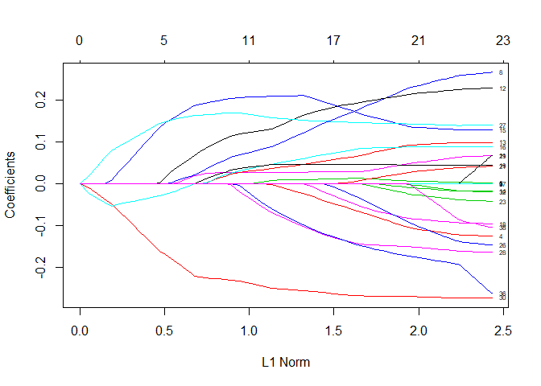
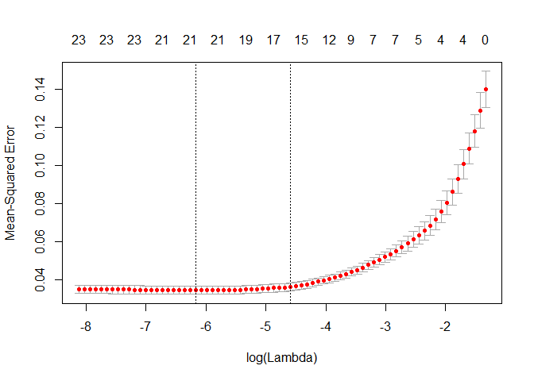

Linear Models
=============

In this file, we will build linear models to predict Log(AV\_TOTAL).

    ## Loading tidyverse: ggplot2
    ## Loading tidyverse: tibble
    ## Loading tidyverse: tidyr
    ## Loading tidyverse: readr
    ## Loading tidyverse: purrr
    ## Loading tidyverse: dplyr

    ## Conflicts with tidy packages ----------------------------------------------

    ## filter(): dplyr, stats
    ## lag():    dplyr, stats

    ## Loading required package: Matrix

    ## 
    ## Attaching package: 'Matrix'

    ## The following object is masked from 'package:tidyr':
    ## 
    ##     expand

    ## Loading required package: foreach

    ## 
    ## Attaching package: 'foreach'

    ## The following objects are masked from 'package:purrr':
    ## 
    ##     accumulate, when

    ## Loaded glmnet 2.0-13

    ## Warning: package 'leaps' was built under R version 3.4.3

In our data, there are a few extraneous columns that we will not be using in this script. There is the raw response variable, AV\_TOTAL, and a scaled version of the response, av\_total\_scaled. There is also an unique identifier for each row, PID, which we will not need for the time being.

``` r
pred <- c("GROSS_AREA",                  "U_KITCH_STYLE_Luxury",        "U_INTERIOR_FINISH_fi",       
          "NUM_FLOORS",                  "U_FPLACE",                    "U_VIEW_Excellent",           
          "U_VIEW_Special",              "U_FULL_BTH",                  "YR_BUILT",                   
          "U_INT_CND_Excellent",         "U_BDRMS",                     "U_HALF_BTH",                 
          "U_ORIENT_fixed_Throu",        "U_NUM_PARK",                  "U_HEAT_TYPE_fixed_Fo",       
          "U_KITCH_TYPE_Full_ea",        "U_BTH_STYLE_Luxury",          "U_HEAT_TYPE_fixed_Ho",       
          "U_BASE_FLOOR",                "U_VIEW_Good",                 "U_CORNER_Yes",               
          "U_ORIENT_fixed_Face_",        "U_TOT_RMS",                   "U_ORIENT_fixed_Middl",       
          "U_INTERIOR_FINISH_fi2",       "U_ORIENT_fixed_Rear_",        "U_INT_CND_Good",             
          "U_VIEW_Fair",                 "U_KITCH_STYLE_No_remodeling", "U_KITCH_STYLE_Semi_modern",  
          "U_ORIENT_fixed_End",          "U_ORIENT_fixed_Rear_above",   "U_ORIENT_fixed_Unknown",     
          "U_HEAT_TYPE_fixed_Heat_Pump", "U_KITCH_TYPE_None",           "U_BTH_STYLE_No_remodeling",  
          "U_BTH_STYLE_Semi_modern",     "Log_LIVING_AREA_"         
)

boston_p <- select(boston, c("Log_AV_TOTAL_", pred))
```

Full Model
----------

We will start by building a model to predict Log\_AV\_TOTAL that ignores the ward of the condo.

The first task is to build a linear regression model with all the predictors. This should give us a sense of what predictors are important. It also gives us an opportunity to look at the variance of the model to check for non-constant variance in the errors.

``` r
boston.lm <- lm(Log_AV_TOTAL_ ~ ., data = boston_p)
summary(boston.lm)
```

    ## 
    ## Call:
    ## lm(formula = Log_AV_TOTAL_ ~ ., data = boston_p)
    ## 
    ## Residuals:
    ##     Min      1Q  Median      3Q     Max 
    ## -2.0868 -0.2057  0.0105  0.2245  1.4224 
    ## 
    ## Coefficients:
    ##                               Estimate Std. Error t value
    ## (Intercept)                 14.0406391  0.1080600  129.93
    ## GROSS_AREA                   0.0001206  0.0000108   11.14
    ## U_KITCH_STYLE_Luxury         0.2199185  0.0123012   17.88
    ## U_INTERIOR_FINISH_fi         0.2205680  0.0088702   24.87
    ## NUM_FLOORS                  -0.0878855  0.0033061  -26.58
    ## U_FPLACE                     0.1464341  0.0028648   51.12
    ## U_VIEW_Excellent             0.2922063  0.0087238   33.50
    ## U_VIEW_Special               0.8175974  0.0334451   24.45
    ## U_FULL_BTH                   0.2043601  0.0040571   50.37
    ## YR_BUILT                    -0.0027983  0.0000381  -73.44
    ## U_INT_CND_Excellent          0.4093997  0.0074828   54.71
    ## U_BDRMS                     -0.0653062  0.0033137  -19.71
    ## U_HALF_BTH                   0.1171249  0.0046008   25.46
    ## U_ORIENT_fixed_Throu        -0.0991616  0.0041298  -24.01
    ## U_NUM_PARK                  -0.0716175  0.0024685  -29.01
    ## U_HEAT_TYPE_fixed_Fo        -0.0456617  0.0058657   -7.78
    ## U_KITCH_TYPE_Full_ea        -0.0920043  0.0033293  -27.63
    ## U_BTH_STYLE_Luxury           0.0807243  0.0126316    6.39
    ## U_HEAT_TYPE_fixed_Ho        -0.0024743  0.0056347   -0.44
    ## U_BASE_FLOOR                 0.0130487  0.0004924   26.50
    ## U_VIEW_Good                  0.1538639  0.0047889   32.13
    ## U_CORNER_Yes                -0.0131364  0.0039208   -3.35
    ## U_ORIENT_fixed_Face_        -0.0699871  0.0094601   -7.40
    ## U_TOT_RMS                   -0.0360588  0.0022474  -16.04
    ## U_ORIENT_fixed_Middl        -0.1220909  0.0091246  -13.38
    ## U_INTERIOR_FINISH_fi2       -0.5265798  0.0591686   -8.90
    ## U_ORIENT_fixed_Rear_        -0.1493242  0.0123945  -12.05
    ## U_INT_CND_Good               0.2254891  0.0041368   54.51
    ## U_VIEW_Fair                  0.0680618  0.0073996    9.20
    ## U_KITCH_STYLE_No_remodeling -0.1237595  0.0158305   -7.82
    ## U_KITCH_STYLE_Semi_modern   -0.0698596  0.0061031  -11.45
    ## U_ORIENT_fixed_End           0.0419098  0.0315480    1.33
    ## U_ORIENT_fixed_Rear_above   -0.0451485  0.0049535   -9.11
    ## U_ORIENT_fixed_Unknown      -0.1720884  0.1130799   -1.52
    ## U_HEAT_TYPE_fixed_Heat_Pump  0.0800469  0.0076748   10.43
    ## U_KITCH_TYPE_None            0.0349408  0.0386907    0.90
    ## U_BTH_STYLE_No_remodeling    0.0698596  0.0154062    4.53
    ## U_BTH_STYLE_Semi_modern      0.0129082  0.0060321    2.14
    ## Log_LIVING_AREA_             0.6200437  0.0133874   46.32
    ##                                         Pr(>|t|)    
    ## (Intercept)                 < 0.0000000000000002 ***
    ## GROSS_AREA                  < 0.0000000000000002 ***
    ## U_KITCH_STYLE_Luxury        < 0.0000000000000002 ***
    ## U_INTERIOR_FINISH_fi        < 0.0000000000000002 ***
    ## NUM_FLOORS                  < 0.0000000000000002 ***
    ## U_FPLACE                    < 0.0000000000000002 ***
    ## U_VIEW_Excellent            < 0.0000000000000002 ***
    ## U_VIEW_Special              < 0.0000000000000002 ***
    ## U_FULL_BTH                  < 0.0000000000000002 ***
    ## YR_BUILT                    < 0.0000000000000002 ***
    ## U_INT_CND_Excellent         < 0.0000000000000002 ***
    ## U_BDRMS                     < 0.0000000000000002 ***
    ## U_HALF_BTH                  < 0.0000000000000002 ***
    ## U_ORIENT_fixed_Throu        < 0.0000000000000002 ***
    ## U_NUM_PARK                  < 0.0000000000000002 ***
    ## U_HEAT_TYPE_fixed_Fo          0.0000000000000071 ***
    ## U_KITCH_TYPE_Full_ea        < 0.0000000000000002 ***
    ## U_BTH_STYLE_Luxury            0.0000000001664482 ***
    ## U_HEAT_TYPE_fixed_Ho                     0.66058    
    ## U_BASE_FLOOR                < 0.0000000000000002 ***
    ## U_VIEW_Good                 < 0.0000000000000002 ***
    ## U_CORNER_Yes                             0.00081 ***
    ## U_ORIENT_fixed_Face_          0.0000000000001400 ***
    ## U_TOT_RMS                   < 0.0000000000000002 ***
    ## U_ORIENT_fixed_Middl        < 0.0000000000000002 ***
    ## U_INTERIOR_FINISH_fi2       < 0.0000000000000002 ***
    ## U_ORIENT_fixed_Rear_        < 0.0000000000000002 ***
    ## U_INT_CND_Good              < 0.0000000000000002 ***
    ## U_VIEW_Fair                 < 0.0000000000000002 ***
    ## U_KITCH_STYLE_No_remodeling   0.0000000000000055 ***
    ## U_KITCH_STYLE_Semi_modern   < 0.0000000000000002 ***
    ## U_ORIENT_fixed_End                       0.18404    
    ## U_ORIENT_fixed_Rear_above   < 0.0000000000000002 ***
    ## U_ORIENT_fixed_Unknown                   0.12806    
    ## U_HEAT_TYPE_fixed_Heat_Pump < 0.0000000000000002 ***
    ## U_KITCH_TYPE_None                        0.36649    
    ## U_BTH_STYLE_No_remodeling     0.0000057852522724 ***
    ## U_BTH_STYLE_Semi_modern                  0.03236 *  
    ## Log_LIVING_AREA_            < 0.0000000000000002 ***
    ## ---
    ## Signif. codes:  0 '***' 0.001 '**' 0.01 '*' 0.05 '.' 0.1 ' ' 1
    ## 
    ## Residual standard error: 0.339 on 56049 degrees of freedom
    ## Multiple R-squared:  0.704,  Adjusted R-squared:  0.704 
    ## F-statistic: 3.52e+03 on 38 and 56049 DF,  p-value: <0.0000000000000002

Plot our regression model. We see some deviation from normality in the residuals in the Q-Q plot. I think that deviation is probably acceptable. There does appear to be non-constant variance in the residuals in the Residuals vs Fitted plot.

``` r
par(mfrow=c(2,2))
plot(boston.lm)
```


The mean squared error of the model is 0.1149.

``` r
mean((predict(boston.lm) - boston$Log_AV_TOTAL_)^2)
```

    ## [1] 0.1149

We built our full model and found the mean squared error. Now, we want to take a closer look at the predictions and examine the values that the model did not predict well.

``` r
predictions <- boston %>% 
  add_predictions(boston.lm, var = "full_pred") %>%
  add_residuals(boston.lm, var = "full_resid") %>%
  mutate(mse  = (full_pred - Log_AV_TOTAL_)^2) %>% 
  select(PID, Ward, Log_AV_TOTAL_, full_pred, full_resid, mse) 
```

Here we look at the mean squared error for each of the wards. This gives us a sense of which wards the full model does a good job predicting (10, 11 21, 22) and which wards it does a bad job of prediciting (12, 14, 18).

``` r
predictions %>% 
  group_by(Ward) %>% 
  summarize(mean_mse = mean(mse)) %>% 
  print(n=1e3)
```

    ## # A tibble: 22 x 2
    ##     Ward mean_mse
    ##    <int>    <dbl>
    ##  1     1  0.16153
    ##  2     2  0.06860
    ##  3     3  0.11033
    ##  4     4  0.15400
    ##  5     5  0.13006
    ##  6     6  0.07465
    ##  7     7  0.06548
    ##  8     8  0.19558
    ##  9     9  0.18526
    ## 10    10  0.05912
    ## 11    11  0.05212
    ## 12    12  0.37877
    ## 13    13  0.14076
    ## 14    14  0.38700
    ## 15    15  0.24722
    ## 16    16  0.17666
    ## 17    17  0.21234
    ## 18    18  0.33801
    ## 19    19  0.08365
    ## 20    20  0.10064
    ## 21    21  0.04951
    ## 22    22  0.04872

### Lasso model selection

Now we will start looking at variable selection methods to simplify the model. The first method will be to use Lasso to eliminate some of the extraneous variables.

We are able to completely remove U\_HEAT\_TYPE\_fixed\_Ho and several predictors are very close to zero. This model improved our mse slightly to 0.1138.

``` r
x <- model.matrix(Log_AV_TOTAL_ ~ ., boston_p)[,-1]
y <- boston_p$Log_AV_TOTAL_

set.seed(1)
train <-  sample(1:nrow(boston_p), nrow(boston_p)*0.8)
test <- (-train)

lasso.boston <- glmnet(x[train,], y[train], alpha = 1)
cv.boston <- cv.glmnet(x[train,], y[train], alpha=1)
  
bestlam <- cv.boston$lambda.min
lasso.pred <- predict(lasso.boston, s=bestlam, newx=x[test,])
mse <- mean((lasso.pred - y[test])^2)

final.boston <- glmnet(x, y, alpha = 1)
lasso.coef <-  predict(final.boston, type="coefficients", s = bestlam)

print(mse)
```

    ## [1] 0.1138

``` r
print(lasso.coef)
```

    ## 39 x 1 sparse Matrix of class "dgCMatrix"
    ##                                      1
    ## (Intercept)                 14.0380083
    ## GROSS_AREA                   0.0001206
    ## U_KITCH_STYLE_Luxury         0.2200437
    ## U_INTERIOR_FINISH_fi         0.2203521
    ## NUM_FLOORS                  -0.0856511
    ## U_FPLACE                     0.1465340
    ## U_VIEW_Excellent             0.2912264
    ## U_VIEW_Special               0.8080880
    ## U_FULL_BTH                   0.2030619
    ## YR_BUILT                    -0.0027842
    ## U_INT_CND_Excellent          0.4068809
    ## U_BDRMS                     -0.0653531
    ## U_HALF_BTH                   0.1145859
    ## U_ORIENT_fixed_Throu        -0.0959749
    ## U_NUM_PARK                  -0.0709492
    ## U_HEAT_TYPE_fixed_Fo        -0.0420990
    ## U_KITCH_TYPE_Full_ea        -0.0917507
    ## U_BTH_STYLE_Luxury           0.0800675
    ## U_HEAT_TYPE_fixed_Ho         .        
    ## U_BASE_FLOOR                 0.0131379
    ## U_VIEW_Good                  0.1534361
    ## U_CORNER_Yes                -0.0104163
    ## U_ORIENT_fixed_Face_        -0.0631339
    ## U_TOT_RMS                   -0.0347411
    ## U_ORIENT_fixed_Middl        -0.1150435
    ## U_INTERIOR_FINISH_fi2       -0.5022081
    ## U_ORIENT_fixed_Rear_        -0.1405930
    ## U_INT_CND_Good               0.2233560
    ## U_VIEW_Fair                  0.0646422
    ## U_KITCH_STYLE_No_remodeling -0.0961149
    ## U_KITCH_STYLE_Semi_modern   -0.0593987
    ## U_ORIENT_fixed_End           0.0327319
    ## U_ORIENT_fixed_Rear_above   -0.0406141
    ## U_ORIENT_fixed_Unknown      -0.1241706
    ## U_HEAT_TYPE_fixed_Heat_Pump  0.0816195
    ## U_KITCH_TYPE_None            0.0036771
    ## U_BTH_STYLE_No_remodeling    0.0413594
    ## U_BTH_STYLE_Semi_modern      0.0001754
    ## Log_LIVING_AREA_             0.6150214

``` r
lp <- predict(final.boston, s=bestlam, newx=x)
lr <- boston$Log_AV_TOTAL_ - lp
lasso <- as_tibble(cbind(boston$PID, round(lp, digits = 3), round(lr, digits = 3)))
names(lasso) <- c("PID","lasso_pred", "lasso_resid")
```

!!!! Not working right now Join the two tables of predictions and residuals into one table.

``` r
#predictions <- predictions %>% left_join(lasso, by = "PID")
```

### Ward Analysis with Lasso

Ward 14
-------

Create a new data frame that only contains the observatiosn from Ward 14 and create the matrices needed to perform Lasso

``` r
ward_14 <- select(boston, c("Log_AV_TOTAL_", "Ward", pred)) %>% 
  filter(Ward == 14)

x <- model.matrix(Log_AV_TOTAL_ ~ ., ward_14[,names(ward_14) != "Ward"])[,-1]
y <- ward_14$Log_AV_TOTAL_
```

Create a train / test split for the data

``` r
set.seed(1)
train <-  sample(1:nrow(ward_14), nrow(ward_14)*0.8)
test <- (-train)
```

Perform lasso on test data and plot result.

``` r
lasso.ward14 <- glmnet(x[train,], y[train], alpha = 1)
plot(lasso.ward14, label = TRUE)
```



Perform cross validation to find the best lambda value.

``` r
cv.ward14 <- cv.glmnet(x[train,], y[train], alpha=1)
plot(cv.ward14)
```



Find the best lambda value and make predictios on the test set. Find the mean squared error on the test set.

``` r
bestlam <- cv.ward14$lambda.min
print(bestlam)
```

    ## [1] 0.00209

``` r
lasso.pred <- predict(lasso.ward14, s=bestlam, newx=x[test,])
print(mean((lasso.pred - y[test])^2))
```

    ## [1] 0.02683

Use the smallest lambda that is within one standard deviation of best lambda. Find the mean squared error on the test set.

``` r
lam_1se <- cv.ward14$lambda.1se
print(lam_1se)
```

    ## [1] 0.01016

``` r
lasso.pred <- predict(lasso.ward14, s=lam_1se, newx=x[test,])
print(mean((lasso.pred - y[test])^2))
```

    ## [1] 0.02937

Using the best lambda value, create a final model using all the data for Ward 14. Print the model coefficients.

``` r
final <- glmnet(x, y, alpha = 1)
lasso.coef <-  predict(final, type="coefficients", s = bestlam)
lasso.coef
```

    ## 39 x 1 sparse Matrix of class "dgCMatrix"
    ##                                        1
    ## (Intercept)                 12.281823729
    ## GROSS_AREA                   0.000138887
    ## U_KITCH_STYLE_Luxury         .          
    ## U_INTERIOR_FINISH_fi         .          
    ## NUM_FLOORS                  -0.111132984
    ## U_FPLACE                     0.002176800
    ## U_VIEW_Excellent             .          
    ## U_VIEW_Special               .          
    ## U_FULL_BTH                   0.224957928
    ## YR_BUILT                    -0.000003152
    ## U_INT_CND_Excellent          .          
    ## U_BDRMS                      0.044880159
    ## U_HALF_BTH                   0.230846741
    ## U_ORIENT_fixed_Throu         0.108324889
    ## U_NUM_PARK                  -0.010054171
    ## U_HEAT_TYPE_fixed_Fo         0.185078761
    ## U_KITCH_TYPE_Full_ea         0.072098653
    ## U_BTH_STYLE_Luxury           .          
    ## U_HEAT_TYPE_fixed_Ho        -0.033062778
    ## U_BASE_FLOOR                 0.048425507
    ## U_VIEW_Good                  .          
    ## U_CORNER_Yes                 0.028340320
    ## U_ORIENT_fixed_Face_         .          
    ## U_TOT_RMS                   -0.033603744
    ## U_ORIENT_fixed_Middl         .          
    ## U_INTERIOR_FINISH_fi2        .          
    ## U_ORIENT_fixed_Rear_        -0.112189126
    ## U_INT_CND_Good               0.130172612
    ## U_VIEW_Fair                 -0.127374630
    ## U_KITCH_STYLE_No_remodeling  .          
    ## U_KITCH_STYLE_Semi_modern   -0.261767529
    ## U_ORIENT_fixed_End           .          
    ## U_ORIENT_fixed_Rear_above   -0.018333640
    ## U_ORIENT_fixed_Unknown       .          
    ## U_HEAT_TYPE_fixed_Heat_Pump  .          
    ## U_KITCH_TYPE_None            .          
    ## U_BTH_STYLE_No_remodeling   -0.187892800
    ## U_BTH_STYLE_Semi_modern     -0.003711248
    ## Log_LIVING_AREA_            -0.080259805

Using the one standard error lambda value, create a final model using all the data for Ward 14. Print the model coefficients.

``` r
final <- glmnet(x, y, alpha = 1)
lasso.coef <-  predict(final, type="coefficients", s = lam_1se)
lasso.coef
```

    ## 39 x 1 sparse Matrix of class "dgCMatrix"
    ##                                       1
    ## (Intercept)                 11.74788816
    ## GROSS_AREA                   0.00004615
    ## U_KITCH_STYLE_Luxury         .         
    ## U_INTERIOR_FINISH_fi         .         
    ## NUM_FLOORS                  -0.05734582
    ## U_FPLACE                     0.00788989
    ## U_VIEW_Excellent             .         
    ## U_VIEW_Special               .         
    ## U_FULL_BTH                   0.14877464
    ## YR_BUILT                     .         
    ## U_INT_CND_Excellent          .         
    ## U_BDRMS                      0.01409710
    ## U_HALF_BTH                   0.19030620
    ## U_ORIENT_fixed_Throu         0.07579952
    ## U_NUM_PARK                   .         
    ## U_HEAT_TYPE_fixed_Fo         0.21345923
    ## U_KITCH_TYPE_Full_ea         0.06257846
    ## U_BTH_STYLE_Luxury           .         
    ## U_HEAT_TYPE_fixed_Ho         .         
    ## U_BASE_FLOOR                 0.04875036
    ## U_VIEW_Good                  .         
    ## U_CORNER_Yes                 .         
    ## U_ORIENT_fixed_Face_         .         
    ## U_TOT_RMS                    .         
    ## U_ORIENT_fixed_Middl         .         
    ## U_INTERIOR_FINISH_fi2        .         
    ## U_ORIENT_fixed_Rear_        -0.00020641
    ## U_INT_CND_Good               0.13527402
    ## U_VIEW_Fair                 -0.10013931
    ## U_KITCH_STYLE_No_remodeling  .         
    ## U_KITCH_STYLE_Semi_modern   -0.25259554
    ## U_ORIENT_fixed_End           .         
    ## U_ORIENT_fixed_Rear_above    .         
    ## U_ORIENT_fixed_Unknown       .         
    ## U_HEAT_TYPE_fixed_Heat_Pump  .         
    ## U_KITCH_TYPE_None            .         
    ## U_BTH_STYLE_No_remodeling   -0.13220361
    ## U_BTH_STYLE_Semi_modern     -0.01112520
    ## Log_LIVING_AREA_             .

!!!!!!!!!!!!!!!!!!!!!!!!!!!!!!!!!!!!!!!!!!!!!!! Make a data frame with the PID, predicted value and residualfor each value in Ward 14 using the final model.

``` r
#w14_l <- boston %>% 
#  filter(Ward == 14) %>% 
#  select(PID)
#w14_PID <- as.matrix(w14_PID)  
#w14_l$p <- predict(final, s=bestlam, newx=x)
#w14_l$r <- ward_14$Log_AV_TOTAL_ - w14_lp
```

``` r
#w14_l
```

Perform and inner join to compare the predicted values from the full model to the predicted values from the ward only model.

``` r
#predictions %>% inner_join(w14_lasso, by = "PID")
```

Summarize the residuals for the ward 14 only model.

``` r
#summary(w14_lr)
```

``` r
#w14_lasso
```

!!!!!!!!!!!!!!!!!!!!!!!!!!!!!!!!!!!!!!!!!!!!!!!!!!!!!!!!!!

Ward Analysis Loop
------------------

Create a data frame to hold my predictor coefficients

``` r
ward_coef <- as_tibble(c("Intercept", pred))
names(ward_coef) <- c("Predictor")
```

``` r
wards = 22
variables = 39
output_best <- matrix(ncol=wards, nrow=variables)
output_1se <- matrix(ncol=wards, nrow=variables)

mse_bestlam <- rep(0,22) 
mse_1se <- rep(0,22) 
```

``` r
for(i in 1:22) {
  ward <- select(boston, c("Log_AV_TOTAL_", "Ward", pred)) %>% 
    filter(Ward == i)

  x <- model.matrix(Log_AV_TOTAL_ ~ ., ward[,names(ward) != "Ward"])[,-1]
  y <- ward$Log_AV_TOTAL_

  set.seed(1)
  train <-  sample(1:nrow(ward), nrow(ward)*0.8)
  test <- (-train)

  lasso.ward <- glmnet(x[train,], y[train], alpha = 1)
  cv.ward <- cv.glmnet(x[train,], y[train], alpha=1)
  
  # use best lambda
  bestlam <- cv.ward$lambda.min
  lasso.pred <- predict(lasso.ward, s=bestlam, newx=x[test,])
  mse_bestlam[i] <- mean((lasso.pred - y[test])^2)

  # use one se lambda
  lam_1se <- cv.ward$lambda.1se
  lasso.pred <- predict(lasso.ward, s=lam_1se, newx=x[test,])
  mse_1se[i] <- mean((lasso.pred - y[test])^2)

  final <- glmnet(x, y, alpha = 1)
  
  lasso.best_coef <-  predict(final, type="coefficients", s = bestlam)
  lasso.1se_coef <-  predict(final, type="coefficients", s = lam_1se)
  
  output_best[,i] <- as.matrix(lasso.best_coef)
  output_1se[,i] <- as.matrix(lasso.1se_coef)
  
}
```

Print the mean squared errors associated with the best lambda values.

``` r
print(mse_bestlam)
```

    ##  [1] 0.01612 0.02230 0.04381 0.03325 0.01652 0.02333 0.04201 0.15052
    ##  [9] 0.13114 0.02194 0.02654 0.02741 0.02078 0.02683 0.02208 0.01308
    ## [17] 0.04242 0.03116 0.03490 0.01739 0.02592 0.01854

Print the mean squared errors associated with the largest lambda that is within one standard deviation of minimum.

``` r
print(mse_1se)
```

    ##  [1] 0.01677 0.02371 0.04504 0.03679 0.01746 0.02479 0.04680 0.15623
    ##  [9] 0.13343 0.02412 0.02885 0.02797 0.02229 0.02937 0.02478 0.01336
    ## [17] 0.04120 0.03439 0.03631 0.01835 0.02729 0.01820

``` r
p <- c("Intercept",pred)
ward_best <- as_tibble(cbind(p,output_best))
ward_1se <- as_tibble(cbind(p,output_1se))


names(ward_best) = c("Predictor","Ward_1","Ward_2","Ward_3","Ward_4","Ward_5","Ward_6","Ward_7","Ward_8","Ward_9","Ward_10","Ward_11","Ward_12","Ward_13","Ward_14","Ward_15","Ward_16","Ward_17","Ward_18","Ward_19","Ward_20","Ward_21","Ward_22")


names(ward_1se) = c("Predictor","Ward_1","Ward_2","Ward_3","Ward_4","Ward_5","Ward_6","Ward_7","Ward_8","Ward_9","Ward_10","Ward_11","Ward_12","Ward_13","Ward_14","Ward_15","Ward_16","Ward_17","Ward_18","Ward_19","Ward_20","Ward_21","Ward_22")

write_csv(ward_best, "Boston_Taxes_Lasso_Coef_best.csv")
write_csv(ward_1se, "Boston_Taxes_Lasso_Coef_1se.csv")
```
