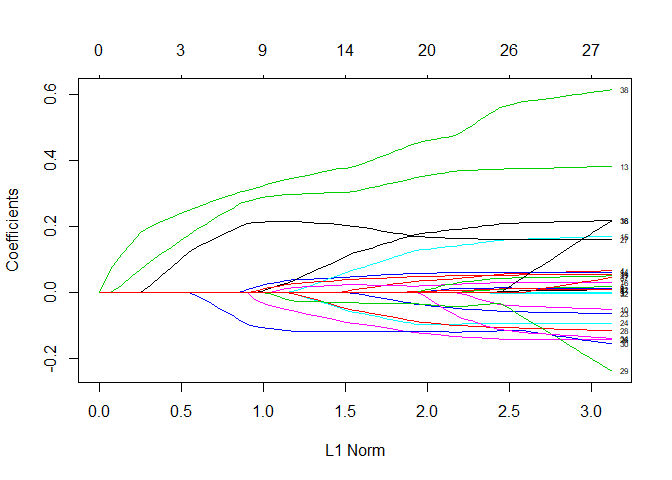
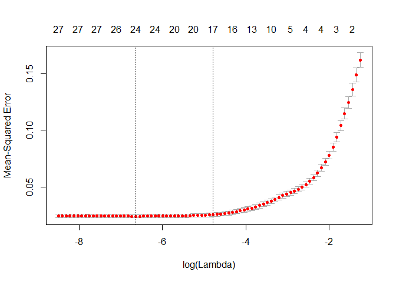

Linear Models for Zipcode Analysis
==================================

In this file, we will build linear models to predict Log(AV\_TOTAL) by zipcode.

    ## Loading tidyverse: ggplot2
    ## Loading tidyverse: tibble
    ## Loading tidyverse: tidyr
    ## Loading tidyverse: readr
    ## Loading tidyverse: purrr
    ## Loading tidyverse: dplyr

    ## Conflicts with tidy packages ----------------------------------------------

    ## filter(): dplyr, stats
    ## lag():    dplyr, stats

    ## Loading required package: Matrix

    ## 
    ## Attaching package: 'Matrix'

    ## The following object is masked from 'package:tidyr':
    ## 
    ##     expand

    ## Loading required package: foreach

    ## 
    ## Attaching package: 'foreach'

    ## The following objects are masked from 'package:purrr':
    ## 
    ##     accumulate, when

    ## Loaded glmnet 2.0-13

    ## Warning: package 'leaps' was built under R version 3.4.3

``` r
str(boston)
```

    ## 'data.frame':    56088 obs. of  42 variables:
    ##  $ GROSS_AREA                 : int  994 1117 691 685 1316 1378 535 535 2310 2343 ...
    ##  $ U_KITCH_STYLE_Luxury       : int  1 0 0 0 1 1 1 1 1 1 ...
    ##  $ U_INTERIOR_FINISH_fi       : int  1 1 1 1 1 1 1 1 0 1 ...
    ##  $ NUM_FLOORS                 : num  1 1 1 1 2 1 1 1 1 1 ...
    ##  $ U_FPLACE                   : int  0 0 0 0 0 0 0 0 3 2 ...
    ##  $ U_VIEW_Excellent           : int  0 0 0 0 0 0 0 0 0 0 ...
    ##  $ U_VIEW_Special             : int  0 0 0 0 0 0 0 0 0 0 ...
    ##  $ U_FULL_BTH                 : int  1 2 1 1 1 2 1 1 3 3 ...
    ##  $ YR_BUILT                   : int  2007 2007 2007 2007 2007 2007 2007 2007 1899 1899 ...
    ##  $ U_INT_CND_Excellent        : int  1 0 0 0 1 1 1 1 1 1 ...
    ##  $ U_BDRMS                    : int  1 2 1 1 1 2 0 0 3 3 ...
    ##  $ U_HALF_BTH                 : int  1 0 0 0 1 0 0 0 0 0 ...
    ##  $ U_ORIENT_fixed_Throu       : int  0 0 0 0 0 0 0 0 1 1 ...
    ##  $ U_NUM_PARK                 : int  1 0 0 0 1 1 0 0 0 0 ...
    ##  $ U_HEAT_TYPE_fixed_Fo       : int  1 1 1 1 1 1 1 1 1 1 ...
    ##  $ U_KITCH_TYPE_Full_ea       : int  0 0 0 0 0 0 0 0 1 1 ...
    ##  $ U_BTH_STYLE_Luxury         : int  1 0 0 0 1 1 1 1 0 1 ...
    ##  $ U_HEAT_TYPE_fixed_Ho       : int  0 0 0 0 0 0 0 0 0 0 ...
    ##  $ U_BASE_FLOOR               : int  12 14 11 12 7 14 19 16 3 5 ...
    ##  $ U_VIEW_Good                : int  0 1 0 0 0 1 1 0 1 1 ...
    ##  $ U_CORNER_Yes               : int  1 0 0 1 0 1 1 1 0 0 ...
    ##  $ U_ORIENT_fixed_Face_       : int  0 0 0 0 0 0 0 0 0 0 ...
    ##  $ U_TOT_RMS                  : int  3 4 3 3 3 4 2 2 6 6 ...
    ##  $ U_ORIENT_fixed_Middl       : int  0 0 0 0 0 0 0 0 0 0 ...
    ##  $ U_INTERIOR_FINISH_fi2      : int  0 0 0 0 0 0 0 0 0 0 ...
    ##  $ U_ORIENT_fixed_Rear_       : int  0 0 0 0 0 0 0 0 0 0 ...
    ##  $ U_INT_CND_Good             : int  0 1 1 1 0 0 0 0 0 0 ...
    ##  $ U_VIEW_Fair                : int  1 0 1 1 0 0 0 0 0 0 ...
    ##  $ U_KITCH_STYLE_No_remodeling: int  0 0 0 0 0 0 0 0 0 0 ...
    ##  $ U_KITCH_STYLE_Semi_modern  : int  0 0 0 0 0 0 0 0 0 0 ...
    ##  $ U_ORIENT_fixed_End         : int  0 0 0 0 0 0 0 0 0 0 ...
    ##  $ U_ORIENT_fixed_Rear_above  : int  1 0 1 1 0 0 1 1 0 0 ...
    ##  $ U_ORIENT_fixed_Unknown     : int  0 0 0 0 0 0 0 0 0 0 ...
    ##  $ U_HEAT_TYPE_fixed_Heat_Pump: int  0 0 0 0 0 0 0 0 0 0 ...
    ##  $ U_KITCH_TYPE_None          : int  0 0 0 0 0 0 0 0 0 0 ...
    ##  $ U_BTH_STYLE_No_remodeling  : int  0 0 0 0 0 0 0 0 0 0 ...
    ##  $ U_BTH_STYLE_Semi_modern    : int  0 0 0 0 0 0 0 0 0 0 ...
    ##  $ PID                        : Factor w/ 56088 levels "0100145002_",..: 10242 10251 10240 10247 10221 10250 10295 10271 10203 10205 ...
    ##  $ Ward                       : int  3 3 3 3 3 3 3 3 3 3 ...
    ##  $ Log_AV_TOTAL_              : num  13.8 14 13.2 13.3 14 ...
    ##  $ Log_LIVING_AREA_           : num  6.9 7.02 6.54 6.53 7.18 ...
    ##  $ zipcode1                   : int  2108 2108 2108 2108 2108 2108 2108 2108 2108 2108 ...

Build the full model using all the predictors.

``` r
boston.lm <- lm(Log_AV_TOTAL_ ~ . - PID - zipcode1 - Ward, data = boston)
summary(boston.lm)
```

    ## 
    ## Call:
    ## lm(formula = Log_AV_TOTAL_ ~ . - PID - zipcode1 - Ward, data = boston)
    ## 
    ## Residuals:
    ##     Min      1Q  Median      3Q     Max 
    ## -2.0868 -0.2057  0.0105  0.2245  1.4224 
    ## 
    ## Coefficients:
    ##                               Estimate Std. Error t value
    ## (Intercept)                 14.0406391  0.1080600  129.93
    ## GROSS_AREA                   0.0001206  0.0000108   11.14
    ## U_KITCH_STYLE_Luxury         0.2199185  0.0123012   17.88
    ## U_INTERIOR_FINISH_fi         0.2205680  0.0088702   24.87
    ## NUM_FLOORS                  -0.0878855  0.0033061  -26.58
    ## U_FPLACE                     0.1464341  0.0028648   51.12
    ## U_VIEW_Excellent             0.2922063  0.0087238   33.50
    ## U_VIEW_Special               0.8175974  0.0334451   24.45
    ## U_FULL_BTH                   0.2043601  0.0040571   50.37
    ## YR_BUILT                    -0.0027983  0.0000381  -73.44
    ## U_INT_CND_Excellent          0.4093997  0.0074828   54.71
    ## U_BDRMS                     -0.0653062  0.0033137  -19.71
    ## U_HALF_BTH                   0.1171249  0.0046008   25.46
    ## U_ORIENT_fixed_Throu        -0.0991616  0.0041298  -24.01
    ## U_NUM_PARK                  -0.0716175  0.0024685  -29.01
    ## U_HEAT_TYPE_fixed_Fo        -0.0456617  0.0058657   -7.78
    ## U_KITCH_TYPE_Full_ea        -0.0920043  0.0033293  -27.63
    ## U_BTH_STYLE_Luxury           0.0807243  0.0126316    6.39
    ## U_HEAT_TYPE_fixed_Ho        -0.0024743  0.0056347   -0.44
    ## U_BASE_FLOOR                 0.0130487  0.0004924   26.50
    ## U_VIEW_Good                  0.1538639  0.0047889   32.13
    ## U_CORNER_Yes                -0.0131364  0.0039208   -3.35
    ## U_ORIENT_fixed_Face_        -0.0699871  0.0094601   -7.40
    ## U_TOT_RMS                   -0.0360588  0.0022474  -16.04
    ## U_ORIENT_fixed_Middl        -0.1220909  0.0091246  -13.38
    ## U_INTERIOR_FINISH_fi2       -0.5265798  0.0591686   -8.90
    ## U_ORIENT_fixed_Rear_        -0.1493242  0.0123945  -12.05
    ## U_INT_CND_Good               0.2254891  0.0041368   54.51
    ## U_VIEW_Fair                  0.0680618  0.0073996    9.20
    ## U_KITCH_STYLE_No_remodeling -0.1237595  0.0158305   -7.82
    ## U_KITCH_STYLE_Semi_modern   -0.0698596  0.0061031  -11.45
    ## U_ORIENT_fixed_End           0.0419098  0.0315480    1.33
    ## U_ORIENT_fixed_Rear_above   -0.0451485  0.0049535   -9.11
    ## U_ORIENT_fixed_Unknown      -0.1720884  0.1130799   -1.52
    ## U_HEAT_TYPE_fixed_Heat_Pump  0.0800469  0.0076748   10.43
    ## U_KITCH_TYPE_None            0.0349408  0.0386907    0.90
    ## U_BTH_STYLE_No_remodeling    0.0698596  0.0154062    4.53
    ## U_BTH_STYLE_Semi_modern      0.0129082  0.0060321    2.14
    ## Log_LIVING_AREA_             0.6200437  0.0133874   46.32
    ##                                         Pr(>|t|)    
    ## (Intercept)                 < 0.0000000000000002 ***
    ## GROSS_AREA                  < 0.0000000000000002 ***
    ## U_KITCH_STYLE_Luxury        < 0.0000000000000002 ***
    ## U_INTERIOR_FINISH_fi        < 0.0000000000000002 ***
    ## NUM_FLOORS                  < 0.0000000000000002 ***
    ## U_FPLACE                    < 0.0000000000000002 ***
    ## U_VIEW_Excellent            < 0.0000000000000002 ***
    ## U_VIEW_Special              < 0.0000000000000002 ***
    ## U_FULL_BTH                  < 0.0000000000000002 ***
    ## YR_BUILT                    < 0.0000000000000002 ***
    ## U_INT_CND_Excellent         < 0.0000000000000002 ***
    ## U_BDRMS                     < 0.0000000000000002 ***
    ## U_HALF_BTH                  < 0.0000000000000002 ***
    ## U_ORIENT_fixed_Throu        < 0.0000000000000002 ***
    ## U_NUM_PARK                  < 0.0000000000000002 ***
    ## U_HEAT_TYPE_fixed_Fo          0.0000000000000071 ***
    ## U_KITCH_TYPE_Full_ea        < 0.0000000000000002 ***
    ## U_BTH_STYLE_Luxury            0.0000000001664482 ***
    ## U_HEAT_TYPE_fixed_Ho                     0.66058    
    ## U_BASE_FLOOR                < 0.0000000000000002 ***
    ## U_VIEW_Good                 < 0.0000000000000002 ***
    ## U_CORNER_Yes                             0.00081 ***
    ## U_ORIENT_fixed_Face_          0.0000000000001400 ***
    ## U_TOT_RMS                   < 0.0000000000000002 ***
    ## U_ORIENT_fixed_Middl        < 0.0000000000000002 ***
    ## U_INTERIOR_FINISH_fi2       < 0.0000000000000002 ***
    ## U_ORIENT_fixed_Rear_        < 0.0000000000000002 ***
    ## U_INT_CND_Good              < 0.0000000000000002 ***
    ## U_VIEW_Fair                 < 0.0000000000000002 ***
    ## U_KITCH_STYLE_No_remodeling   0.0000000000000055 ***
    ## U_KITCH_STYLE_Semi_modern   < 0.0000000000000002 ***
    ## U_ORIENT_fixed_End                       0.18404    
    ## U_ORIENT_fixed_Rear_above   < 0.0000000000000002 ***
    ## U_ORIENT_fixed_Unknown                   0.12806    
    ## U_HEAT_TYPE_fixed_Heat_Pump < 0.0000000000000002 ***
    ## U_KITCH_TYPE_None                        0.36649    
    ## U_BTH_STYLE_No_remodeling     0.0000057852522724 ***
    ## U_BTH_STYLE_Semi_modern                  0.03236 *  
    ## Log_LIVING_AREA_            < 0.0000000000000002 ***
    ## ---
    ## Signif. codes:  0 '***' 0.001 '**' 0.01 '*' 0.05 '.' 0.1 ' ' 1
    ## 
    ## Residual standard error: 0.339 on 56049 degrees of freedom
    ## Multiple R-squared:  0.704,  Adjusted R-squared:  0.704 
    ## F-statistic: 3.52e+03 on 38 and 56049 DF,  p-value: <0.0000000000000002

Plot the diagnostic plots for the full model.

``` r
par(mfrow=c(2,2))
plot(boston.lm)
```


We will take a closer look at the mean squared error by zipcode.

``` r
predictions <- boston %>% 
  add_predictions(boston.lm, var = "full_pred") %>%
  add_residuals(boston.lm, var = "full_resid") %>%
  mutate(mse  = (full_pred - Log_AV_TOTAL_)^2) %>% 
  select(PID, zipcode1, Log_AV_TOTAL_, full_pred, full_resid, mse) 
```

Zipcode = 02136 was a bad prediction

``` r
predictions %>% 
  group_by(zipcode1) %>% 
  summarize(mean_mse = mean(mse)) %>% 
  print(n=1e3)
```

    ## # A tibble: 30 x 2
    ##    zipcode1 mean_mse
    ##       <int>    <dbl>
    ##  1     2108  0.10855
    ##  2     2109  0.12327
    ##  3     2110  0.11361
    ##  4     2111  0.08089
    ##  5     2113  0.14962
    ##  6     2114  0.10254
    ##  7     2115  0.09848
    ##  8     2116  0.15641
    ##  9     2118  0.17307
    ## 10     2119  0.22643
    ## 11     2120  0.09156
    ## 12     2121  0.38765
    ## 13     2122  0.20512
    ## 14     2124  0.21407
    ## 15     2125  0.14402
    ## 16     2126  0.34834
    ## 17     2127  0.06532
    ## 18     2128  0.16153
    ## 19     2129  0.06860
    ## 20     2130  0.05472
    ## 21     2131  0.14182
    ## 22     2132  0.14172
    ## 23     2134  0.04149
    ## 24     2135  0.04371
    ## 25     2136  0.43135
    ## 26     2199  0.08369
    ## 27     2210  0.08242
    ## 28     2215  0.08427
    ## 29     2446  0.20134
    ## 30     2467  0.04925

### Zipcode Analysis with Lasso

Zipcode 02136
-------------

Create a new data frame that only contains the observatiosn from Ward 14 and create the matrices needed to perform Lasso

``` r
zip_02136 <- filter(boston, zipcode1 == 2136)

x <- model.matrix(Log_AV_TOTAL_ ~ . - PID - zipcode1 - Ward, zip_02136)[,-1]
y <- zip_02136$Log_AV_TOTAL_
```

Create a train / test split for the data

``` r
set.seed(1)
train <-  sample(1:nrow(zip_02136), nrow(zip_02136)*0.7)
test <- (-train)
```

Perform lasso on test data and plot result.

``` r
lasso.zip_02136 <- glmnet(x[train,], y[train], alpha = 1)
plot(lasso.zip_02136, label = TRUE)
```



Perform cross validation to find the best lambda value.

``` r
cv.zip_02136 <- cv.glmnet(x[train,], y[train], alpha=1)
plot(cv.zip_02136)
```



Find the best lambda value and make predictios on the test set. Find the mean squared error on the test set.

``` r
bestlam <- cv.zip_02136$lambda.min
cat("Best Lambda:",bestlam,"\n")
```

    ## Best Lambda: 0.001302

``` r
lasso.pred <- predict(lasso.zip_02136, s=bestlam, newx=x[test,])
cat("MSE: ", mean((lasso.pred - y[test])^2),"\n")
```

    ## MSE:  0.02859

``` r
lam_1se <- cv.zip_02136$lambda.1se
cat("One SE Lambda:", lam_1se, "\n")
```

    ## One SE Lambda: 0.008368

``` r
lasso.pred <- predict(lasso.zip_02136, s=lam_1se, newx=x[test,])
cat("MSE:", mean((lasso.pred - y[test])^2))
```

    ## MSE: 0.03076

Using the best lambda value, compare models using the best lambda and the one SE model.

``` r
final_b <- glmnet(x, y, alpha = 1)
lasso.coef_b <-  predict(final_b, type="coefficients", s = bestlam)

final_se <- glmnet(x, y, alpha = 1)
lasso.coef_se <-  predict(final_se, type="coefficients", s = lam_1se)
cbind(lasso.coef_b, lasso.coef_se)
```

    ## 39 x 2 sparse Matrix of class "dgCMatrix"
    ##                                      1         1
    ## (Intercept)                  8.8661404  8.766159
    ## GROSS_AREA                   .          .       
    ## U_KITCH_STYLE_Luxury         0.0307707  .       
    ## U_INTERIOR_FINISH_fi         .          .       
    ## NUM_FLOORS                   0.0498250  0.037545
    ## U_FPLACE                     0.0094704  .       
    ## U_VIEW_Excellent             .          .       
    ## U_VIEW_Special               .          .       
    ## U_FULL_BTH                   0.0396895  0.007075
    ## YR_BUILT                    -0.0002084  .       
    ## U_INT_CND_Excellent         -0.0178990  .       
    ## U_BDRMS                     -0.0031597  .       
    ## U_HALF_BTH                   0.0355838  0.020082
    ## U_ORIENT_fixed_Throu         0.3615525  0.336056
    ## U_NUM_PARK                   0.0526026  0.050329
    ## U_HEAT_TYPE_fixed_Fo         0.1550634  0.123224
    ## U_KITCH_TYPE_Full_ea         0.0108127  0.002299
    ## U_BTH_STYLE_Luxury           .          .       
    ## U_HEAT_TYPE_fixed_Ho         0.2124804  0.177458
    ## U_BASE_FLOOR                 0.0522416  0.047632
    ## U_VIEW_Good                  .          .       
    ## U_CORNER_Yes                 0.0427440  .       
    ## U_ORIENT_fixed_Face_         .          .       
    ## U_TOT_RMS                   -0.0558967 -0.027475
    ## U_ORIENT_fixed_Middl        -0.1018640 -0.081721
    ## U_INTERIOR_FINISH_fi2        .          .       
    ## U_ORIENT_fixed_Rear_        -0.1303289 -0.094333
    ## U_INT_CND_Good               0.1570220  0.170671
    ## U_VIEW_Fair                 -0.1564694 -0.120224
    ## U_KITCH_STYLE_No_remodeling -0.0437719 -0.031097
    ## U_KITCH_STYLE_Semi_modern   -0.1198373 -0.121692
    ## U_ORIENT_fixed_End           .          .       
    ## U_ORIENT_fixed_Rear_above   -0.0118537  .       
    ## U_ORIENT_fixed_Unknown       .          .       
    ## U_HEAT_TYPE_fixed_Heat_Pump -0.0632654  .       
    ## U_KITCH_TYPE_None            .          .       
    ## U_BTH_STYLE_No_remodeling    .          .       
    ## U_BTH_STYLE_Semi_modern      .          .       
    ## Log_LIVING_AREA_             0.4825981  0.435904

Zipcode Analysis Loop
---------------------

Create a data frame to hold my predictor coefficients

``` r
coef <- colnames(boston)
coef <- coef[!coef %in% c("Ward","zipcode1","PID","Log_AV_TOTAL_")]

zip_coef <- as_tibble(c("Intercept", coef))
names(zip_coef) <- c("Predictor")
```

Create empty variables to hold my outputs.

``` r
n_zipcode = 28
variables = 39
output_best <- matrix(ncol=n_zipcode, nrow=variables)
output_1se <- matrix(ncol=n_zipcode, nrow=variables)

mse_bestlam <- rep(0,n_zipcode) 
mse_1se <- rep(0,n_zipcode) 

# create a vector of zipcodes for loop 
zipcodes <- boston %>% count(zipcode1)
zipcodes <- zipcodes$zipcode1
```

Two zipcodes only have 3 and 7 observations: 2199, 2446. These are removed

``` r
boston <- subset(boston, zipcode1 != 2199 & zipcode1 != 2446)
zipcodes <- subset(zipcodes, zipcodes != 2199 & zipcodes != 2446)
```

Loop to find a lasso model for each zipcode

``` r
for(i in 1:28) {
  
  zip <- boston %>% filter(zipcode1 == zipcodes[i])

  x <- model.matrix(Log_AV_TOTAL_ ~ . - PID - zipcode1 - Ward, zip)[,-1]
  y <- zip$Log_AV_TOTAL_

  set.seed(1)
  train <-  sample(1:nrow(zip), nrow(zip)*0.7)
  test <- (-train)

  lasso.zip <- glmnet(x[train,], y[train], alpha = 1)
  cv.zip <- cv.glmnet(x[train,], y[train], alpha = 1)
  
  # use best lambda
  bestlam <- cv.zip$lambda.min
  lasso.pred <- predict(lasso.zip, s=bestlam, newx=x[test,])
  mse_bestlam[i] <- mean((lasso.pred - y[test])^2)

  # use one se lambda
  lam_1se <- cv.zip$lambda.1se
  lasso.pred <- predict(lasso.zip, s=lam_1se, newx=x[test,])
  mse_1se[i] <- mean((lasso.pred - y[test])^2)

  final <- glmnet(x, y, alpha = 1)
  
  lasso.best_coef <-  predict(final, type="coefficients", s = bestlam)
  lasso.1se_coef <-  predict(final, type="coefficients", s = lam_1se)
  
  output_best[,i] <- as.matrix(lasso.best_coef)
  output_1se[,i] <- as.matrix(lasso.1se_coef)
  
}
```

Print the mean squared errors associated with each zipcode.

``` r
cbind(zipcodes, mse_bestlam,mse_1se)
```

    ##       zipcodes mse_bestlam  mse_1se
    ##  [1,]     2108    0.013085 0.016344
    ##  [2,]     2109    0.019231 0.025415
    ##  [3,]     2110    0.007701 0.007626
    ##  [4,]     2111    0.021560 0.023089
    ##  [5,]     2113    0.044887 0.049571
    ##  [6,]     2114    0.018876 0.020699
    ##  [7,]     2115    0.029876 0.030854
    ##  [8,]     2116    0.026710 0.028765
    ##  [9,]     2118    0.062033 0.064950
    ## [10,]     2119    0.058652 0.065855
    ## [11,]     2120    0.037163 0.040657
    ## [12,]     2121    0.032382 0.033458
    ## [13,]     2122    0.016323 0.016638
    ## [14,]     2124    0.033196 0.035971
    ## [15,]     2125    0.026497 0.028126
    ## [16,]     2126    0.032580 0.037020
    ## [17,]     2127    0.019488 0.020287
    ## [18,]     2128    0.015535 0.016205
    ## [19,]     2129    0.020551 0.021559
    ## [20,]     2130    0.016677 0.019340
    ## [21,]     2131    0.025826 0.027182
    ## [22,]     2132    0.013928 0.015015
    ## [23,]     2134    0.016223 0.017676
    ## [24,]     2135    0.013375 0.013968
    ## [25,]     2136    0.028592 0.030756
    ## [26,]     2210    0.026543 0.045402
    ## [27,]     2215    0.028452 0.032028
    ## [28,]     2467    0.008629 0.011260

Wrtie an csv file with all the models created.

``` r
#p <- c("Intercept",pred)
zip_best <- as_tibble(cbind(zip_coef,output_best))
zip_1se <- as_tibble(cbind(zip_coef,output_1se))


names(zip_best) = c("Predictor",zipcodes)
names(zip_1se) = c("Predictor",zipcodes)

write_csv(zip_best, "Boston_Taxes_Lasso_Coef_best_zip.csv")
write_csv(zip_1se, "Boston_Taxes_Lasso_Coef_1se_zip.csv")
```
